# C# Introduction & .NET Ecosystem

**Course:** C#14 & .NET 10  
**Instructor:** Mohamed Elshafei

---

## Table of Contents
1. [[#What is C#?]]
2. [[#Key Advantages of C#]]
3. [[#Compilation Process]]
4. [[#JIT Compilation]]
5. [[#CLR (Common Language Runtime)]]
6. [[#.NET Evolution & Versions]]
7. [[#Development Environment]]
8. [[#Code Protection & Obfuscation]]

---

## What is C#?

### Definition
C# (pronounced "C-Sharp") is a **modern, object-oriented programming language** developed by Microsoft in **2002**. It runs on the .NET platform and is designed for building various types of applications.

### Core Characteristics
- **Strongly Typed Language**: Type safety enforced at compile-time
- **Automatic Memory Management**: Garbage collector handles memory allocation and deallocation
- **Runs on .NET Platform**: Cross-platform runtime environment

### Application Types You Can Build

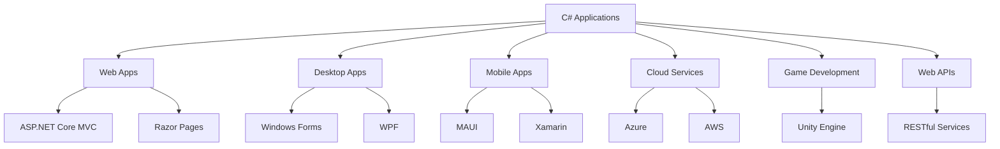

**Explanation of Each Type:**
- **Web Apps**: Server-side web applications using ASP.NET Core MVC or Razor Pages
- **Desktop Apps**: Rich desktop applications using Windows Forms (older) or WPF (modern)
- **Mobile Apps**: Cross-platform mobile apps using MAUI (modern) or Xamarin (legacy)
- **Cloud Services**: Scalable cloud applications hosted on Azure or AWS
- **Game Development**: 2D/3D games using the Unity game engine
- **Web APIs**: Backend services that provide data to frontend applications

---

## Key Advantages of C#

### 1. Strongly Typed Language
**What it means**: Every variable must have a declared type, and type checking happens at compile-time.

**Benefit**: Catches errors before the program runs, reducing runtime crashes.

```csharp
// Example
int age = 25;        // ✅ Correct
age = "twenty-five"; // ❌ Compile-time error - cannot assign string to int
```

### 2. Automatic Memory Management
**What it means**: The Garbage Collector (GC) automatically frees memory that's no longer being used.

**Benefit**: Prevents memory leaks and reduces developer burden.

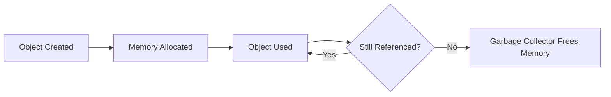

### 3. High Performance
- **RyuJIT**: Advanced Just-In-Time compiler for runtime optimization
- **NativeAOT**: Ahead-of-Time compilation for even faster startup and execution

### 4. Cross-Platform
Since .NET 5+, C# runs on:
- Windows
- Linux
- macOS

### 5. Built-in Async/Await
Simplified asynchronous programming for responsive applications.

```csharp
// Example: Non-blocking code
async Task<string> FetchDataAsync()
{
    await Task.Delay(1000); // Simulates async operation
    return "Data loaded";
}
```

### 6. Large Ecosystem
- **NuGet Package Manager**: Millions of reusable packages
- Access to extensive libraries for almost any task

### 7. Excellent Tools
- **Visual Studio**: Full-featured IDE with debugging, profiling, and IntelliSense
- **Rider**: JetBrains IDE alternative
- **VS Code**: Lightweight editor with C# extensions

---

## Compilation Process

The compilation process transforms your C# source code into executable code through multiple stages.

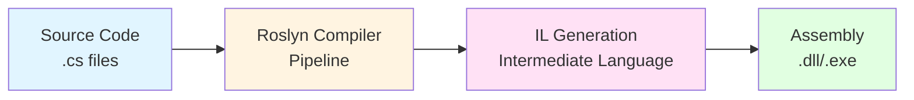

### Stage-by-Stage Breakdown

#### Stage 1: Source Code
- Developer writes `.cs` files
- Contains classes, methods, and program logic
- Human-readable text

#### Stage 2: Roslyn Compiler Pipeline
The **Roslyn** compiler is Microsoft's modern compiler platform. It performs three main analyses:

1. **Lexical Analysis**: Breaks code into tokens (keywords, identifiers, operators)
2. **Syntax Analysis**: Checks if code follows C# grammar rules
3. **Semantic Analysis**: Verifies meaning (type checking, scope resolution)

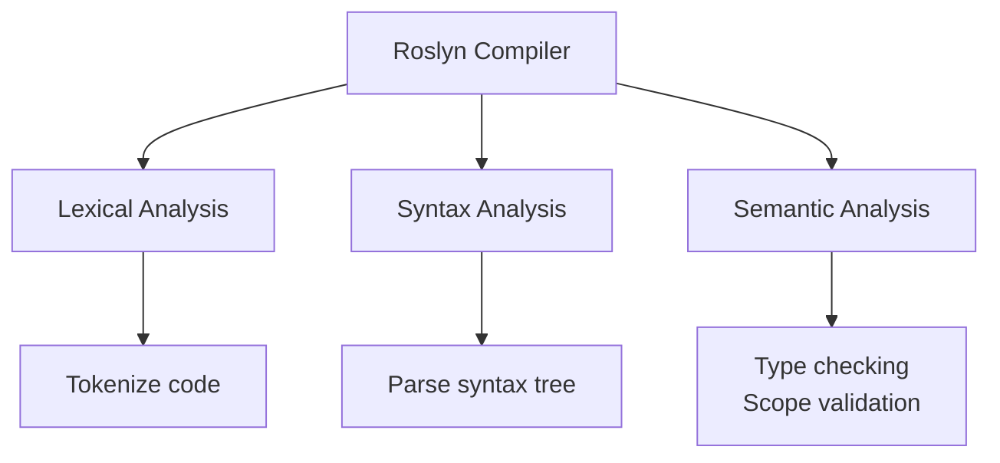

#### Stage 3: IL Generation
- Converts C# code to **Intermediate Language (IL)**
- IL is **CPU-independent** (not tied to specific processor architecture)
- Similar to assembly language but platform-neutral

**Why IL?**
- Enables cross-platform execution
- Allows different .NET languages (C#, F#, VB.NET) to work together
- Provides a layer for optimization

#### Stage 4: Assembly Output
- **`.dll`**: Class libraries (reusable code components)
- **`.exe`**: Executable applications (programs you can run)

**Important**: The `.exe` file doesn't contain native machine code yet—it contains IL code that will be compiled to native code at runtime.

---

## JIT Compilation

### What is JIT?
**JIT (Just-In-Time) Compilation** converts IL code to native machine code **at runtime**, right before execution.

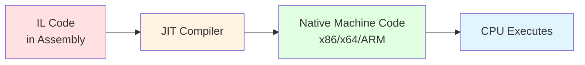

### JIT Compilation Process Flow

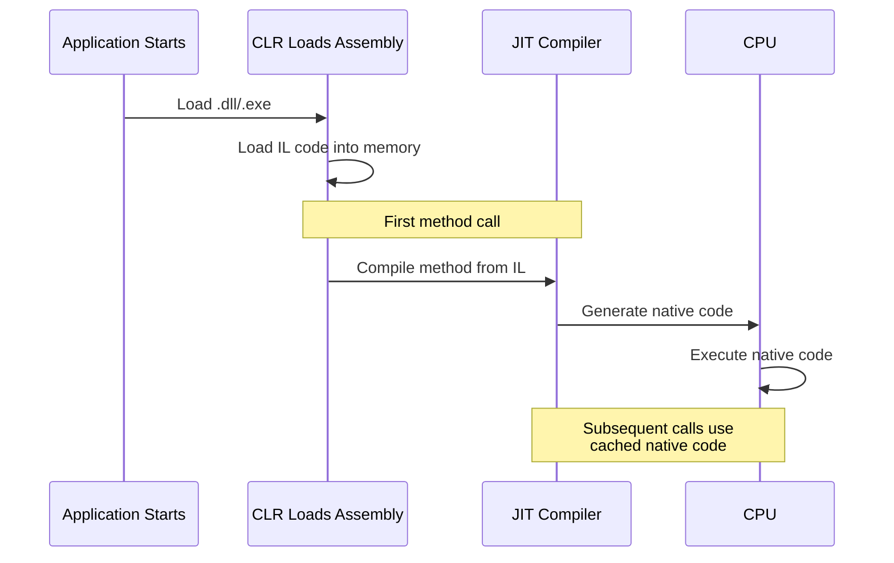

### Types of JIT Compilers

| Type | Description | Use Case |
|------|-------------|----------|
| **Standard JIT (RyuJIT)** | Default, highly optimized compiler | General applications (recommended) |
| **Econo-JIT** | Legacy compiler with less optimization | Older systems (deprecated) |
| **Pre-JIT (NGen)** | Compiles at installation time | Faster startup, used for system libraries |

### Key Benefits of JIT Compilation

1. **Platform Independence**
   - IL code works on any platform
   - JIT compiles to native code for that specific CPU

2. **Runtime Optimization**
   - JIT can optimize based on actual runtime conditions
   - Adapts to CPU features available on the machine

3. **Improved Security**
   - Code verification happens before execution
   - Prevents certain types of attacks

**Trade-off**: Slight startup delay for first-time method compilation (solved by NativeAOT in performance-critical apps)

---

## CLR (Common Language Runtime)

The **CLR** is the execution engine for .NET applications. Think of it as the "operating system" for .NET programs.

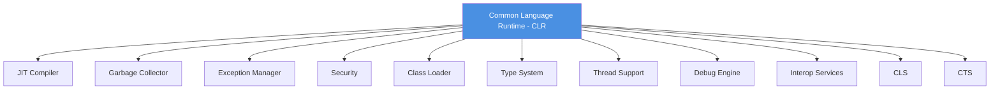

### CLR Components Explained

#### 1. JIT Compiler
- Converts IL to native machine code
- Caches compiled methods for reuse

#### 2. Garbage Collector (GC)
- **Automatic memory management**
- Identifies unused objects and frees memory
- Runs in background to optimize performance

**How GC Works**:
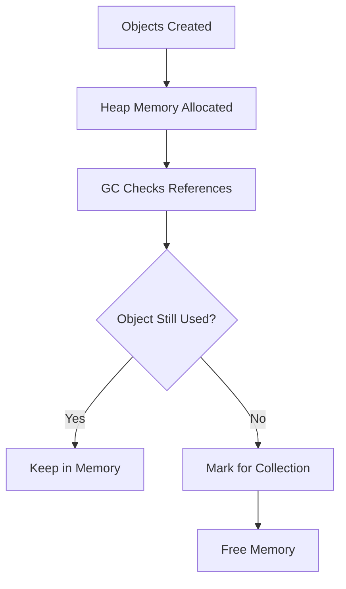

#### 3. Exception Manager
- Handles runtime errors gracefully
- Provides try-catch-finally mechanism
- Prevents application crashes

#### 4. Security
- **Code Access Security (CAS)**: Controls what code can do
- **Type Safety**: Prevents memory corruption
- Enforces permissions for file access, network, etc.

#### 5. Class Loader
- Loads assemblies (`.dll`/`.exe`) into memory
- Loads types (classes, interfaces) when first used
- Manages metadata about types

#### 6. Type System
- Enforces strict type checking
- Ensures type safety throughout execution
- Validates type conversions

#### 7. Thread Support
- Provides multithreading capabilities
- Manages thread scheduling and synchronization
- Enables parallel processing

#### 8. Debug Engine
- Allows debugging of applications
- Supports breakpoints, step execution, variable inspection
- Works with Visual Studio debugger

#### 9. Interop Services
- **P/Invoke**: Call native Windows APIs or C libraries
- **COM Interop**: Interact with older COM components
- Bridges managed (.NET) and unmanaged code

#### 10. CLS (Common Language Specification)
- **Common syntax rules** supported by all .NET languages
- Ensures interoperability between C#, F#, VB.NET, etc.
- Example: All languages can use integers, strings, classes

#### 11. CTS (Common Type System)
- **Common data types** shared across all .NET languages
- Defines how types are declared, used, and managed
- Example: `int` in C# = `Integer` in VB.NET = `int32` in IL

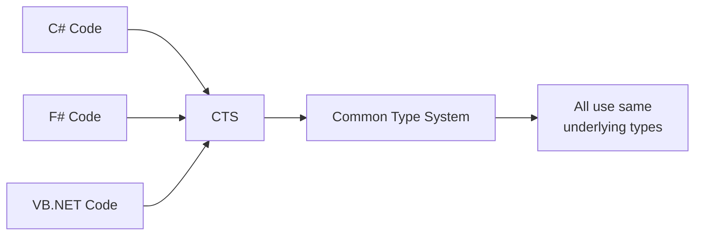

---

## .NET Evolution & Versions

Understanding the evolution helps you know which framework to use for your projects.

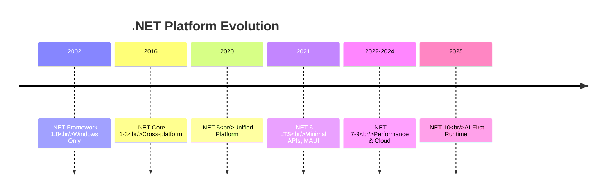

### Detailed Version Breakdown

#### .NET Framework 1.0 (2002-2019)
- **Platform**: Windows only
- **Features**: Windows Forms, WPF, ASP.NET
- **Status**: Legacy (maintenance mode only)
- **Use**: Only for maintaining old Windows applications

#### .NET Core 1-3 (2016-2019)
- **Platform**: Cross-platform (Windows, Linux, macOS)
- **Features**: 
  - Razor Pages for web development
  - SPA (Single Page Application) templates
  - Blazor (WebAssembly and Server)
- **Innovation**: Rewrite from scratch for modern development

#### .NET 5 (2020)
- **Platform**: Unified platform merging .NET Framework and .NET Core
- **Features**:
  - Single SDK for all platforms
  - Significant performance improvements
  - Full cross-platform support
- **Note**: Dropped "Core" from name to indicate unification

#### .NET 6 LTS (2021)
- **LTS**: Long-Term Support (3 years of updates)
- **Features**:
  - **Minimal APIs**: Simplified API creation with less boilerplate
  - **MAUI**: Multi-platform App UI for mobile/desktop apps
- **Recommended**: Great choice for production applications

#### .NET 7-9 (2022-2024)
- **Focus**: Performance and cloud-native features
- **Features**:
  - **NativeAOT**: Ahead-of-Time compilation for faster startup
  - Cloud-native optimizations for containers
  - Enhanced performance across the board

#### .NET 10 (2025)
- **Focus**: AI-first runtime
- **Features**:
  - AI integration built into the framework
  - Cloud-optimized for modern workloads
  - Enhanced AOT compilation
- **Current**: Latest version with cutting-edge features

### LTS vs Non-LTS

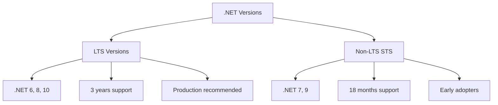

**Recommendation**: Use **LTS versions** (like .NET 6 or 8) for production applications to ensure long-term support.

---

## Development Environment

### Setting Up Visual Studio 2026

#### Step 1: Download Visual Studio
1. Go to [https://visualstudio.microsoft.com/downloads/](https://visualstudio.microsoft.com/downloads/)
2. Choose **Community Edition** (free for individuals and small teams)

#### Step 2: Install Required Components
During installation, select these workloads:

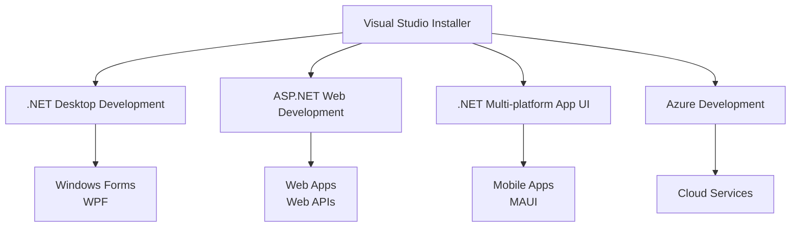

**Essential Workloads**:
- **.NET Desktop Development**: For desktop applications (WPF, Windows Forms)
- **ASP.NET and Web Development**: For web apps and APIs
- **.NET Multi-platform App UI**: For mobile/cross-platform apps (MAUI)
- **Azure Development**: For cloud applications (optional but recommended)

#### Step 3: First Project
After installation:
1. Open Visual Studio
2. Click "Create a new project"
3. Choose a template (e.g., "Console App" for beginners)
4. Configure project name and location
5. Start coding!

---

## Code Protection & Obfuscation

When you compile C# code, the IL (Intermediate Language) can be easily reverse-engineered. **Obfuscation** protects your code from being decompiled and stolen.

### Why Obfuscate?

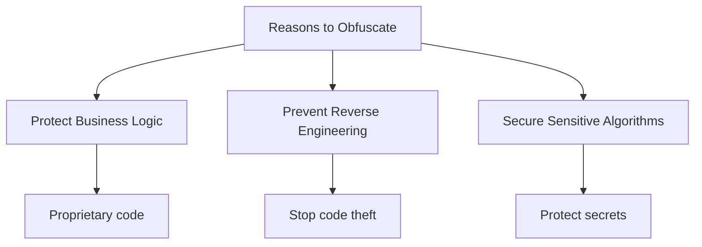

**Real-world scenario**: If you develop a commercial application with unique algorithms, competitors could decompile your `.dll` files and steal your intellectual property.

### What Obfuscation Does

#### 1. Renames Symbols
Changes class and method names to meaningless strings.

**Before Obfuscation**:
```csharp
public class PaymentProcessor {
    public void ProcessCreditCard(string cardNumber) {
        // Implementation
    }
}
```

**After Obfuscation**:
```csharp
public class a {
    public void b(string c) {
        // Implementation
    }
}
```

#### 2. Encrypts Strings
Protects sensitive text like API keys or connection strings.

**Before**: `string apiKey = "sk_live_12345";`  
**After**: `string apiKey = Decrypt("x7k9m2...");` (encrypted at compile time)

#### 3. Modifies Control Flow
Complicates program logic to make reverse engineering harder.

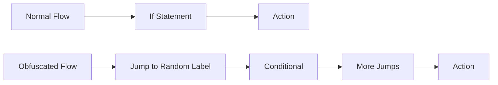

#### 4. Adds Anti-Debugging
Prevents debuggers from attaching to your application.

### Popular Obfuscation Tools

| Tool | Type | Features |
|------|------|----------|
| **Dotfuscator Community** | Free | Basic obfuscation, good for small projects |
| **Babel Obfuscator** | Commercial | Advanced features, strong protection |
| **ConfuserEx** | Open-source | Free, customizable, actively maintained |

**Recommendation**: Start with **ConfuserEx** for learning, upgrade to commercial tools for production apps with high security needs.

**Learn More**: [What is Obfuscation?](https://www.preemptive.com/what-is-obfuscation/)

---

## Summary & Key Takeaways

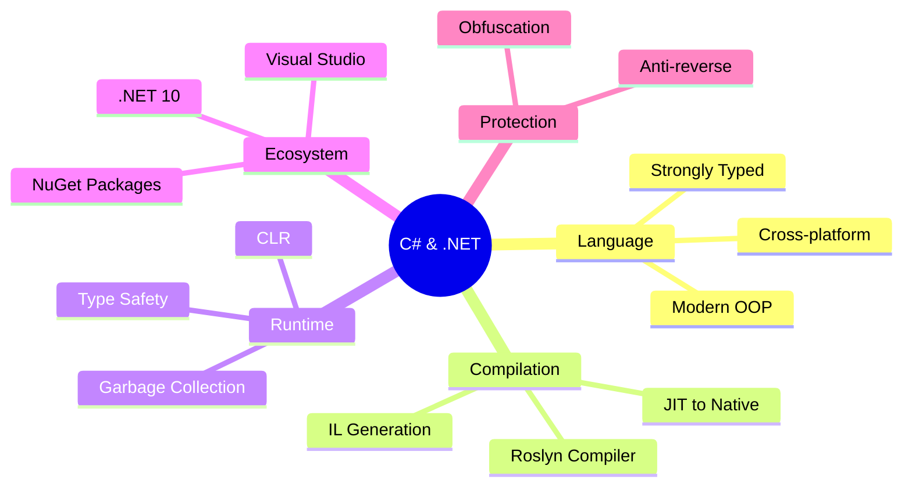

### Essential Points to Remember

1. **C# is versatile**: Build web, desktop, mobile, cloud, and game applications
2. **Two-stage compilation**: C# → IL → Native code (via JIT)
3. **CLR manages everything**: Memory, types, exceptions, security
4. **Use LTS versions**: .NET 6, 8, or 10 for production
5. **Visual Studio is powerful**: Full IDE with debugging and IntelliSense
6. **Protect your code**: Use obfuscation for commercial applications

---

## Study Tips

- [ ] Understand the compilation flow: Source → IL → Native
- [ ] Memorize CLR components and their roles
- [ ] Know the difference between .NET Framework and .NET Core/5+
- [ ] Practice creating a simple console app in Visual Studio
- [ ] Experiment with decompiling a `.dll` to understand why obfuscation matters

---

## Related Topics to Explore

- [[Object-Oriented Programming in C#]]
- [[Async/Await Programming]]
- [[Entity Framework & Databases]]
- [[ASP.NET Core Web Development]]
- [[MAUI Mobile Development]]

---

**Last Updated**: January 2026  
**Course**: C#14 & .NET 10 by Mohamed Elshafei