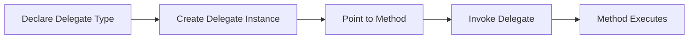
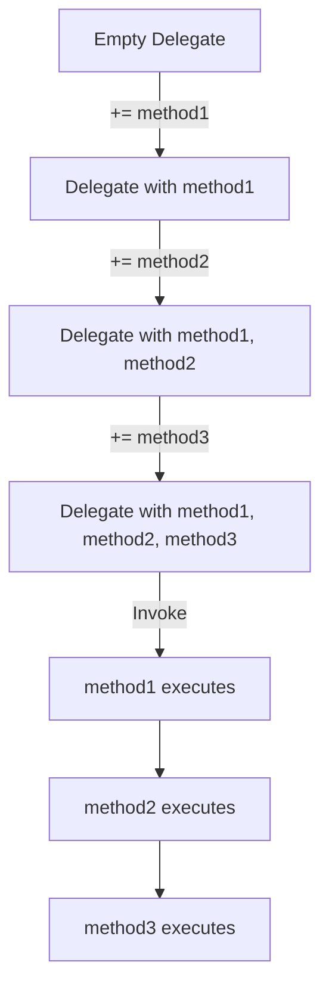
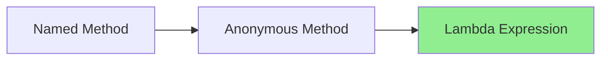
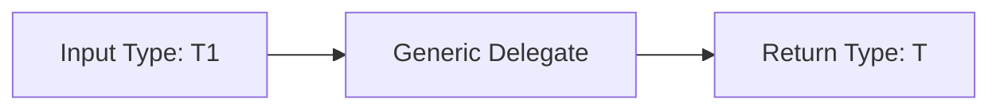
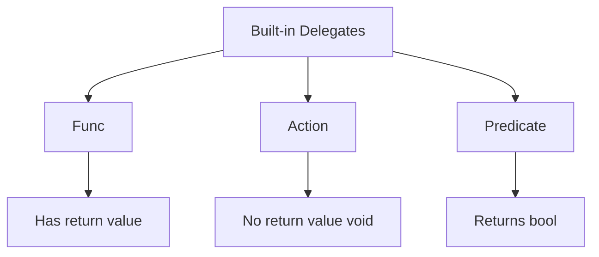
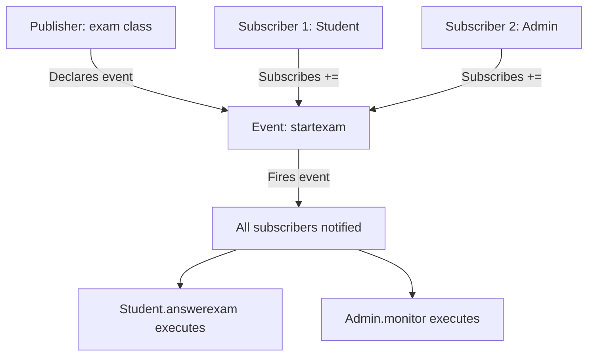

# C# Delegates and Events - Complete Study Guide

## Table of Contents

1. [Delegates Fundamentals](#delegates-fundamentals)
2. [Multicast Delegates](#multicast-delegates)
3. [Anonymous Methods](#anonymous-methods)
4. [Generic Delegates](#generic-delegates)
5. [Built-in Delegates](#built-in-delegates)
6. [Events](#events)
7. [Complete Code Examples](#complete-code-examples)

---

## Delegates Fundamentals

### What is a Delegate?

A **delegate** is a type-safe function pointer in C#. It's a reference type that holds references to methods with a specific signature.

**Think of it as:** A delegate is like a variable that stores a method instead of data.

### Delegate Declaration Syntax

```csharp
delegate returnType DelegateName(parameters);
```

### Basic Delegate Flow



### Example Implementation

```csharp
// 1. Declare delegate type
delegate int mydel(int x, int y);

// 2. Create methods matching the signature
class operation
{
    public int sum(int x, int y)
    {
        Console.WriteLine($"sum={x+y}");
        return x + y;
    }
    
    public int sub(int x, int y)
    {
        Console.WriteLine($"sub={x-y}");
        return x - y;
    }
}

// 3. Use the delegate
operation op = new operation();

// Method 1: Explicit instantiation
mydel d = new mydel(op.sum);

// Method 2: Simplified syntax (preferred)
mydel d = op.sum;

// 4. Invoke the delegate
int result = d.Invoke(3, 5);  // Output: sum=8
// OR
int result = d(3, 5);  // Shorthand
```

### Key Points

- Delegates must match the method signature exactly (return type and parameters)
- You can reassign delegates to point to different methods
- Static methods can also be referenced by delegates

---

## Multicast Delegates

### What is Multicasting?

A **multicast delegate** holds references to multiple methods. When invoked, all methods in the invocation list are called sequentially.

### Multicast Operations



### Implementation

```csharp
delegate int mydel(int x, int y);

operation op = new operation();

// Adding multiple methods
mydel d = op.mul;
d += op.sum;
d += op.sub;

// When invoked, all three methods execute
int result = d(7, 3);
// Output:
// mul=21
// sum=10
// sub=4
// Returns: 4 (last method's return value)
```

### Important Notes

- **Return Value:** Only the last method's return value is returned
- **Adding:** Use `+=` to add methods to the invocation list
- **Removing:** Use `-=` to remove methods

### Combining and Removing Delegates

```csharp
mydel d1 = op.sum;
d1 += op.sub;

mydel d2 = op.mul;
d2 += op.sub;
d2 += operation.div;

// Subtract one delegate from another
mydel d3 = d2 - d1;  // d3 = mul + div (sum and sub removed)

d3(7, 3);
// Output:
// mul=21
// div=2
```

---

## Anonymous Methods

### What are Anonymous Methods?

Anonymous methods allow you to define inline methods without explicitly declaring them. They're useful for one-time use delegates.

### Evolution of Syntax



### Syntax Comparison

```csharp
// 1. Traditional named method
public int Add(int x, int y)
{
    return x + y;
}
mydel d = Add;

// 2. Anonymous method
mydel d = delegate(int x, int y)
{
    return x + y;
};

// 3. Lambda expression (modern, preferred)
mydel d = (x, y) => x + y;
```

### Inline Usage

```csharp
static void calc(int x, int y, Func<int, int, int> d)
{
    Console.WriteLine(d.Invoke(x, y));
}

// Using anonymous method
calc(4, 5, delegate(int x, int y) { return x + y; });

// Using lambda expression
calc(4, 5, (x, y) => x - y);
```

### Lambda Expression Syntax Breakdown

```
(parameters) => expression
  ↓            ↓      ↓
 Input       Lambda  Output
            Operator
```

**Examples:**

```csharp
// No parameters
() => Console.WriteLine("Hello");

// One parameter (parentheses optional)
x => x * x;

// Multiple parameters
(x, y) => x + y;

// Statement body (multiple lines)
(x, y) => 
{
    int sum = x + y;
    return sum * 2;
};
```

---

## Generic Delegates

### What are Generic Delegates?

Generic delegates allow you to create flexible delegate types that work with multiple data types.

### Declaration

```csharp
delegate T mydel3<T, T1>(T1 input);
```

### Type Flow Diagram



### Implementation

```csharp
class operation
{
    // Returns int, takes string
    public int display(string txt)
    {
        return int.Parse(txt);
    }
    
    // Returns string, takes int
    public string test(int x)
    {
        return x.ToString();
    }
}

operation op = new operation();

// String input → int output
mydel3<int, string> d1 = op.display;
int result1 = d1("123");  // result1 = 123

// Int input → string output
mydel3<string, int> d2 = op.test;
string result2 = d2(456);  // result2 = "456"
```

---

## Built-in Delegates

C# provides three main built-in delegate types so you don't need to declare custom delegates for common scenarios.

### The Three Built-in Delegates



### 1. Func<> Delegate

**Purpose:** Represents a method that **returns a value**

**Syntax:** `Func<input1, input2, ..., output>`

- Last type parameter is the **return type**
- Can have 0-16 input parameters

```csharp
// Func with 2 int inputs, 1 int output
Func<int, int, int> d = op.sum;
d(5, 4);  // Returns int

// Func with 1 string input, 1 int output
Func<string, int> converter = int.Parse;
int num = converter("42");

// Func with no input, string output
Func<string> greeter = () => "Hello World";
string msg = greeter();
```

### 2. Action<> Delegate

**Purpose:** Represents a method with **no return value** (void)

**Syntax:** `Action<input1, input2, ...>`

- No return type parameter needed
- Can have 0-16 input parameters

```csharp
// Action with 2 int inputs
Action<int, int> d1 = op.display;
d1(5, 4);  // Returns void

// Action with 1 string input
Action<string> logger = (msg) => Console.WriteLine(msg);
logger("Logging message");

// Action with no input
Action greet = () => Console.WriteLine("Hello!");
greet();
```

### 3. Predicate<> Delegate

**Purpose:** Represents a method that takes **one parameter** and **returns bool**

**Syntax:** `Predicate<T>`

- Always returns bool
- Always takes exactly one parameter

```csharp
// Predicate for checking if number is positive
Predicate<int> isPositive = (x) => x > 0;
bool result1 = isPositive(5);   // true
bool result2 = isPositive(-3);  // false

// Predicate for checking if string is empty
Predicate<string> isEmpty = (s) => string.IsNullOrEmpty(s);
bool result3 = isEmpty("");     // true
bool result4 = isEmpty("Hi");   // false

// Commonly used with List.FindAll
List<int> numbers = new List<int> { 1, -2, 3, -4, 5 };
List<int> positives = numbers.FindAll(isPositive);
// positives = {1, 3, 5}
```

### Comparison Table

|Delegate Type|Return Type|Input Parameters|Example|
|---|---|---|---|
|`Func<T>`|Any type (last type param)|0-16 parameters|`Func<int, int, int>`|
|`Action<T>`|void|0-16 parameters|`Action<int, int>`|
|`Predicate<T>`|bool|Exactly 1 parameter|`Predicate<int>`|

---

## Events

### What is an Event?

An **event** is a special kind of multicast delegate that provides **controlled access** to delegate invocation. Events follow the **publisher-subscriber pattern**.

### Publisher-Subscriber Pattern



### Event vs Delegate

|Feature|Delegate|Event|
|---|---|---|
|Access|Can be invoked by anyone|Only invoked by declaring class|
|Assignment|Can use `=` (overwrite)|Cannot use `=`, only `+=` or `-=`|
|Purpose|General callback|Publisher-subscriber pattern|

### EventHandler Delegates

C# provides built-in event handler delegates:

```csharp
// Generic EventHandler
delegate void EventHandler<TEventArgs>(object sender, TEventArgs e) 
    where TEventArgs : EventArgs

// Non-generic EventHandler
delegate void EventHandler(object sender, EventArgs e)
```

**Parameters:**

- `sender`: The object that raised the event
- `e`: Event data (must inherit from EventArgs)

### Complete Event Implementation

#### Step 1: Create Event Arguments Class

```csharp
class examArgs : EventArgs
{
    public string location { get; set; }
    public DateTime starttime { get; set; }
    
    public examArgs(string location, DateTime starttime)
    {
        this.location = location;
        this.starttime = starttime;
    }
}
```

#### Step 2: Create Publisher Class

```csharp
class exam
{
    public int id { get; set; }
    public string subjectname { get; set; }
    public int duration { get; set; }
    public Dictionary<string, List<string>> questions { get; set; }

    // Declare the event
    public event EventHandler<examArgs> startexam;
    
    public exam(int id, string subjectname, int duration, 
                Dictionary<string, List<string>> questions)
    {
        this.id = id;
        this.subjectname = subjectname;
        this.duration = duration;
        this.questions = questions;
    }

    // Method to raise the event
    public void OnStartExam()
    {
        // Null-conditional operator ensures no null reference exception
        startexam?.Invoke(this, new examArgs("lec3", DateTime.Now.AddMinutes(15)));
    }

    public override string ToString()
    {
        StringBuilder txt = new StringBuilder(
            $"Num:{id} \t Subject:{subjectname} \t Duration:{duration} minutes \n");

        foreach (var item in questions)
        {
            txt.Append(item.Key + "?\n");
            foreach (var ans in item.Value)
            {
                txt.Append(ans + "\n");
            }
        }
        return txt.ToString();
    }
}
```

#### Step 3: Create Subscriber Classes

```csharp
class Student
{
    public int id { get; set; }
    public string name { get; set; }
    public int age { get; set; }
    
    public Student(int id = 0, string name = " ", int age = 6)
    {
        this.id = id;
        this.name = name;
        this.age = age;
    }

    // Event handler method
    public void answerexam(object sender, examArgs e)
    {
        exam ex = sender as exam;
        Console.WriteLine(ex);
        Console.WriteLine($"student {name} start answer exam @{e.location}");
    }

    public override string ToString()
    {
        return $"{id}-{name}-{age}years old";
    }
}

class Admin
{
    public int id { get; set; }
    public string name { get; set; }
    public int age { get; set; }
    
    public Admin(int id = 0, string name = " ", int age = 6)
    {
        this.id = id;
        this.name = name;
        this.age = age;
    }

    // Event handler method
    public void monitior(object sender, examArgs e)
    {
        exam ex = sender as exam;
        Console.WriteLine($"admin {name} start monitor {ex.subjectname} exam " +
                         $"location {e.location} @ {e.starttime.ToShortTimeString()}, " +
                         $"exam duration: {ex.duration} Minutes...");
    }

    public override string ToString()
    {
        return $"{id}-{name}-{age}years old";
    }
}
```

#### Step 4: Subscribe and Raise Event

```csharp
// Create exam with questions
Dictionary<string, List<string>> dic = new Dictionary<string, List<string>>();
dic.Add("What is polymorphism?", new List<string>() 
    { "1-Encapsulation", "2-Inheritance", "3-Multiple forms" });
dic.Add("What is inheritance?", new List<string>() 
    { "1-Data hiding", "2-Reusing code", "3-Abstraction" });

exam ex = new exam(1, "C#", 90, dic);

// Create subscribers
Student st = new Student(2, "ali", 20);
Admin ad = new Admin(3, "mahmoud", 40);

// Subscribe to event
ex.startexam += st.answerexam;
ex.startexam += ad.monitior;

// Raise the event
ex.OnStartExam();

/* Output:
Num:1    Subject:C#    Duration:90 minutes
What is polymorphism??
1-Encapsulation
2-Inheritance
3-Multiple forms
What is inheritance??
1-Data hiding
2-Reusing code
3-Abstraction

student ali start answer exam @lec3
admin mahmoud start monitor C# exam location lec3 @ [time], exam duration: 90 Minutes...
*/
```

### Event Best Practices

1. **Naming Convention:** Event names are usually verbs (e.g., `Click`, `StartExam`, `DataReceived`)
    
2. **Null Check:** Always check if event has subscribers before invoking
    
    ```csharp
    // Method 1: Traditional
    if (startexam != null)
        startexam.Invoke(this, e);
    
    // Method 2: Null-conditional (preferred)
    startexam?.Invoke(this, e);
    ```
    
3. **EventArgs Pattern:** Custom event data should inherit from `EventArgs`
    
4. **Sender Parameter:** First parameter should be `object sender` (the publisher)
    
5. **Protected Raise Method:** Use protected virtual methods for raising events
    
    ```csharp
    protected virtual void OnStartExam(examArgs e)
    {
        startexam?.Invoke(this, e);
    }
    ```
    

---

## Complete Code Examples

### Example 1: Calculator with Delegates

```csharp
using System;

namespace DelegateCalculator
{
    delegate int MathOperation(int x, int y);
    
    class Calculator
    {
        public int Add(int x, int y) => x + y;
        public int Subtract(int x, int y) => x - y;
        public int Multiply(int x, int y) => x * y;
        public int Divide(int x, int y) => x / y;
    }
    
    class Program
    {
        static void ExecuteOperation(int a, int b, MathOperation operation, string opName)
        {
            int result = operation(a, b);
            Console.WriteLine($"{opName}: {a} and {b} = {result}");
        }
        
        static void Main()
        {
            Calculator calc = new Calculator();
            
            ExecuteOperation(10, 5, calc.Add, "Addition");
            ExecuteOperation(10, 5, calc.Subtract, "Subtraction");
            ExecuteOperation(10, 5, calc.Multiply, "Multiplication");
            ExecuteOperation(10, 5, calc.Divide, "Division");
            
            // Using lambda
            ExecuteOperation(10, 5, (x, y) => x % y, "Modulus");
        }
    }
}
```

### Example 2: Notification System with Events

```csharp
using System;
using System.Collections.Generic;

namespace NotificationSystem
{
    // Event arguments
    class MessageEventArgs : EventArgs
    {
        public string Message { get; set; }
        public DateTime Timestamp { get; set; }
        public string Severity { get; set; }
        
        public MessageEventArgs(string message, string severity)
        {
            Message = message;
            Severity = severity;
            Timestamp = DateTime.Now;
        }
    }
    
    // Publisher
    class NotificationService
    {
        public event EventHandler<MessageEventArgs> MessageReceived;
        
        public void SendNotification(string message, string severity)
        {
            Console.WriteLine($"\n[Service] Sending {severity} notification...\n");
            OnMessageReceived(new MessageEventArgs(message, severity));
        }
        
        protected virtual void OnMessageReceived(MessageEventArgs e)
        {
            MessageReceived?.Invoke(this, e);
        }
    }
    
    // Subscriber 1: Email handler
    class EmailHandler
    {
        public string EmailAddress { get; set; }
        
        public EmailHandler(string email)
        {
            EmailAddress = email;
        }
        
        public void HandleMessage(object sender, MessageEventArgs e)
        {
            Console.WriteLine($"[EMAIL to {EmailAddress}]");
            Console.WriteLine($"  Severity: {e.Severity}");
            Console.WriteLine($"  Message: {e.Message}");
            Console.WriteLine($"  Time: {e.Timestamp:HH:mm:ss}");
        }
    }
    
    // Subscriber 2: SMS handler
    class SmsHandler
    {
        public string PhoneNumber { get; set; }
        
        public SmsHandler(string phone)
        {
            PhoneNumber = phone;
        }
        
        public void HandleMessage(object sender, MessageEventArgs e)
        {
            if (e.Severity == "Critical" || e.Severity == "High")
            {
                Console.WriteLine($"[SMS to {PhoneNumber}]");
                Console.WriteLine($"  URGENT: {e.Message}");
            }
        }
    }
    
    // Subscriber 3: Logger
    class Logger
    {
        private List<string> logs = new List<string>();
        
        public void LogMessage(object sender, MessageEventArgs e)
        {
            string logEntry = $"[{e.Timestamp:yyyy-MM-dd HH:mm:ss}] " +
                            $"[{e.Severity}] {e.Message}";
            logs.Add(logEntry);
            Console.WriteLine($"[LOG] {logEntry}");
        }
        
        public void DisplayLogs()
        {
            Console.WriteLine("\n=== All Logs ===");
            foreach (var log in logs)
            {
                Console.WriteLine(log);
            }
        }
    }
    
    class Program
    {
        static void Main()
        {
            // Create publisher
            NotificationService service = new NotificationService();
            
            // Create subscribers
            EmailHandler emailHandler = new EmailHandler("admin@company.com");
            SmsHandler smsHandler = new SmsHandler("+1-555-0123");
            Logger logger = new Logger();
            
            // Subscribe to event
            service.MessageReceived += emailHandler.HandleMessage;
            service.MessageReceived += smsHandler.HandleMessage;
            service.MessageReceived += logger.LogMessage;
            
            // Send notifications
            service.SendNotification("System started successfully", "Info");
            service.SendNotification("High CPU usage detected", "Warning");
            service.SendNotification("Database connection failed!", "Critical");
            
            // Display all logs
            logger.DisplayLogs();
        }
    }
}
```

### Example 3: Built-in Delegates Showcase

```csharp
using System;
using System.Collections.Generic;
using System.Linq;

namespace BuiltInDelegatesDemo
{
    class Program
    {
        static void Main()
        {
            // ===== FUNC Examples =====
            Console.WriteLine("=== FUNC Examples ===\n");
            
            // Func: String to int
            Func<string, int> stringLength = (s) => s.Length;
            Console.WriteLine($"Length of 'Hello': {stringLength("Hello")}");
            
            // Func: Two ints to int
            Func<int, int, int> multiply = (x, y) => x * y;
            Console.WriteLine($"5 * 6 = {multiply(5, 6)}");
            
            // Func: No parameters to string
            Func<string> getGreeting = () => $"Hello! Time is {DateTime.Now:HH:mm:ss}";
            Console.WriteLine(getGreeting());
            
            
            // ===== ACTION Examples =====
            Console.WriteLine("\n=== ACTION Examples ===\n");
            
            // Action: Print a message
            Action<string> printMessage = (msg) => Console.WriteLine($"Message: {msg}");
            printMessage("This is an action delegate");
            
            // Action: Two parameters
            Action<string, int> printPersonInfo = (name, age) => 
                Console.WriteLine($"{name} is {age} years old");
            printPersonInfo("Alice", 25);
            
            // Action: No parameters
            Action sayHello = () => Console.WriteLine("Hello from Action!");
            sayHello();
            
            
            // ===== PREDICATE Examples =====
            Console.WriteLine("\n=== PREDICATE Examples ===\n");
            
            List<int> numbers = new List<int> { 1, 2, 3, 4, 5, 6, 7, 8, 9, 10 };
            
            // Predicate: Check if even
            Predicate<int> isEven = (n) => n % 2 == 0;
            List<int> evenNumbers = numbers.FindAll(isEven);
            Console.WriteLine($"Even numbers: {string.Join(", ", evenNumbers)}");
            
            // Predicate: Check if greater than 5
            Predicate<int> greaterThanFive = (n) => n > 5;
            List<int> bigNumbers = numbers.FindAll(greaterThanFive);
            Console.WriteLine($"Numbers > 5: {string.Join(", ", bigNumbers)}");
            
            // Predicate with strings
            List<string> words = new List<string> 
                { "apple", "banana", "cherry", "date", "elderberry" };
            Predicate<string> startsWithC = (s) => s.StartsWith("c");
            List<string> cWords = words.FindAll(startsWithC);
            Console.WriteLine($"Words starting with 'c': {string.Join(", ", cWords)}");
            
            
            // ===== Combined Example =====
            Console.WriteLine("\n=== Combined Example: Data Processing ===\n");
            
            List<int> data = new List<int> { 15, 22, 8, 31, 45, 12, 7, 38 };
            
            // Use Predicate to filter
            Predicate<int> isLarge = (n) => n > 20;
            List<int> largeNumbers = data.FindAll(isLarge);
            
            // Use Func to transform
            Func<int, string> formatNumber = (n) => $"[{n}]";
            
            // Use Action to display
            Action<string> display = (s) => Console.WriteLine(s);
            
            Console.WriteLine("Large numbers (>20) formatted:");
            foreach (int num in largeNumbers)
            {
                display(formatNumber(num));
            }
        }
    }
}
```

---

## Study Tips

### Key Concepts to Remember

1. **Delegate = Type-safe function pointer**
2. **Multicast = Multiple methods in one delegate**
3. **Event = Controlled delegate with publisher-subscriber pattern**
4. **Func = Returns a value**
5. **Action = Returns void**
6. **Predicate = Returns bool, one parameter**

### Practice Exercises

1. Create a delegate that can hold methods with signature `string MethodName(int x, double y)`
2. Implement a multicast delegate that calls 5 different methods
3. Convert a named method to a lambda expression
4. Create an event-based system for a simple game (player attacks, enemy responds)
5. Use `Func`, `Action`, and `Predicate` to process a list of students

### Common Mistakes to Avoid

- ❌ Forgetting to check if event is null before invoking
- ❌ Using `=` instead of `+=` for events (won't compile)
- ❌ Confusing delegate declaration with delegate instantiation
- ❌ Forgetting that multicast delegates return only the last method's value
- ❌ Not matching method signatures exactly with delegate types

---

_Last Updated: Based on C# 8.0+ features_