# Day 5: C# Advanced Concepts - Parameter Passing & Exception Handling

## Table of Contents

1. [[#Parameter Passing Mechanisms]]
2. [[#Method Overloading & Parameters]]
3. [[#Exception Handling]]
4. [[#Custom Exceptions]]

---

## Parameter Passing Mechanisms

### Overview

C# provides different ways to pass parameters to methods, each affecting how data is transferred and modified.

### 1. Pass by Value (Default)

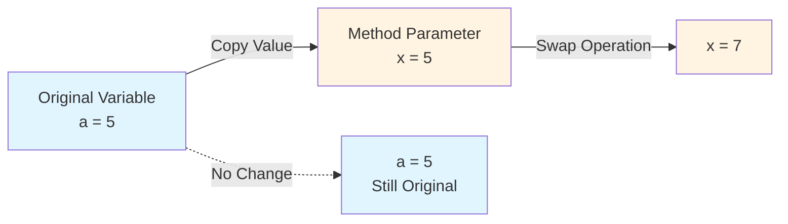

**Commented Out Code Example:**

```csharp
public void swap(int x , int y)
{
    int temp = x;
    x = y;
    y = temp;
}
// ❌ This DOESN'T work - changes only affect copies
```

**Why it fails:** The method receives **copies** of the original values. Changes inside the method don't affect the original variables.

---

### 2. Pass by Reference (`ref`)

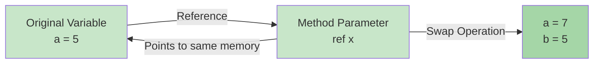

**Working Code Example:**

```csharp
public void swap(ref int x, ref int y)
{
    int temp = x;
    x = y;
    y = temp;
}

// Usage:
int a = 5, b = 7;
op.swap(ref a, ref b);
// ✅ Result: a = 7, b = 5
```

**Key Points:**

- Variable **must be initialized** before passing
- Changes affect the **original variable**
- Use `ref` keyword at both **declaration and call site**
- Works with **value types** (int, double) and **reference types** (arrays, objects)

#### Reference Type Behavior with Arrays

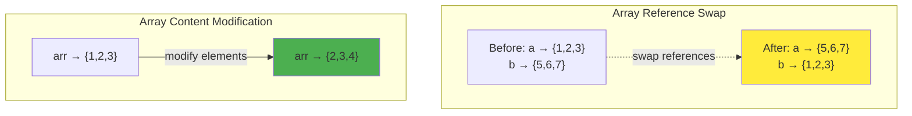

**Array Swap Example:**

```csharp
int[] a = { 1, 2, 3 };
int[] b = { 5, 6, 7 };
op.swap(ref a, ref b);
// Result: a = {5,6,7}, b = {1,2,3}
```

**Array Content Modification Example:**

```csharp
public void increase(int[] x)
{
    for (int i = 0; i < x.Length; i++) 
        x[i]++;
}

int[] a = { 1, 2, 3 };
op.increase(a);
// Result: a = {2,3,4} - Changed without ref because array is reference type
```

---

### 3. Output Parameters (`out`)

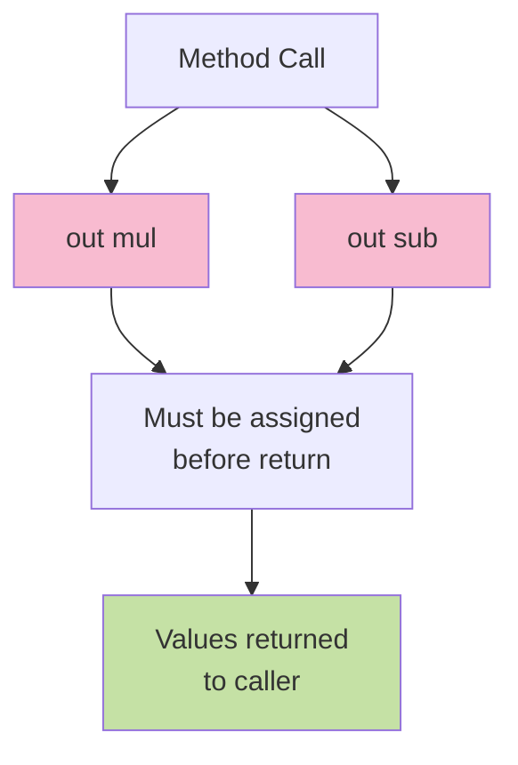

**Code Example:**

```csharp
public int calc(int x, int y, out int mul, out int sub, in int z)
{
    mul = x * y;  // ✅ Must assign before return
    sub = x - y;  // ✅ Must assign before return
    return x + y;
}

// Usage:
int s, m, sub;
s = op.calc(7, 3, out m, out sub, in someValue);
// Result: s = 10, m = 21, sub = 4
```

**Comparison Table:**

|Feature|`ref`|`out`|
|---|---|---|
|**Initialization Required**|✅ Yes, before passing|❌ No|
|**Assignment Required**|❌ No|✅ Yes, before return|
|**Use Case**|Modify existing value|Return multiple values|
|**Reading Before Assignment**|✅ Allowed|❌ Not allowed|

---

### 4. Read-Only Reference (`in`)

```csharp
public int calc(int x, int y, out int mul, out int sub, in int z)
{
    // z is read-only
    // z = 10; ❌ Compilation error
    return x + y + z;
}
```

**Purpose:** Pass by reference for **performance** (avoid copying large structs) while **preventing modification**.

**When to Use:**

- Passing large structs (e.g., custom structures with many fields)
- Want efficiency of `ref` but safety of pass-by-value
- Ensuring the method doesn't accidentally modify the parameter

---

## Method Overloading & Parameters

### 1. Default Parameter Values

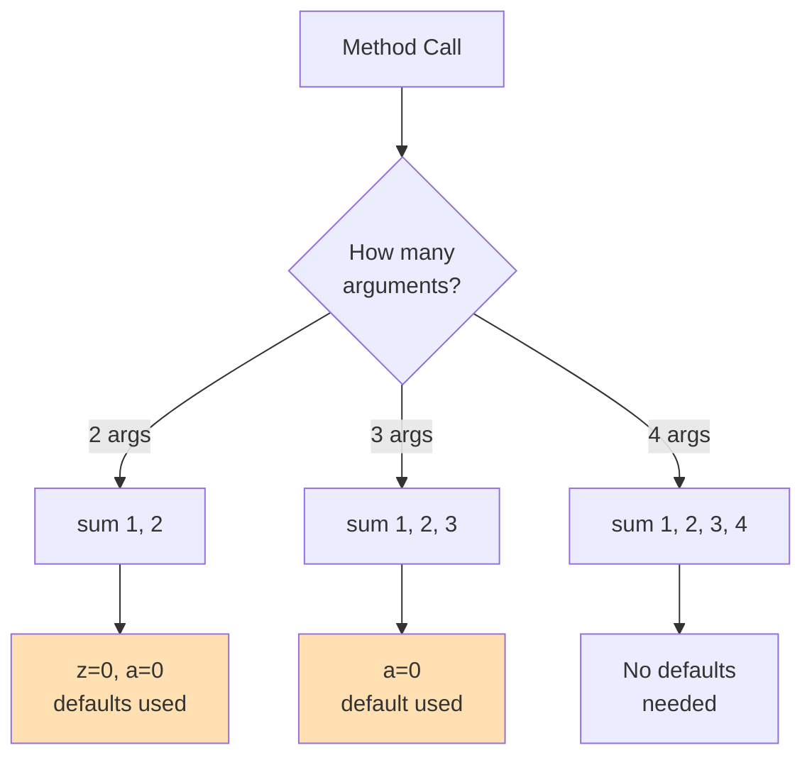

**Code Example:**

```csharp
public int sum(int x, int y, int z=0, int a=0)
{
    return x + y + z + a;  
}

// Usage:
sum(1, 2)       // Returns 3  (z=0, a=0)
sum(1, 2, 3)    // Returns 6  (a=0)
sum(1, 2, 3, 4) // Returns 10
```

**Rules:**

- Default parameters must be **at the end**
- Once you add a default, **all following parameters** must have defaults
- Can't have: `int sum(int x=0, int y)` ❌

**Employee Constructor Example:**

```csharp
public employee(int _id=0, string _name="", int _age=6)
{
    id = _id;
    name = _name;
    age = _age;
}

employee em1 = new employee(1, "ali", 22);  // All specified
employee em2 = new employee();              // All defaults
employee em3 = new employee(1);             // Only id specified
employee em4 = new employee(1, "ali");      // id and name specified
```

---

### 2. Named Parameters

```csharp
employee em5 = new employee(_name:"ali");           // Only name
employee em6 = new employee(_age:6);                // Only age
employee em7 = new employee(_age:6, _name:"mostafa"); // Any order
employee em8 = new employee(_age:5, _id:4);         // Any order
employee em9 = new employee(_name:"ali", _id:4);    // Any order
```

**Benefits:**

- Skip parameters with defaults
- **Any order** when all are named
- Improves code **readability**
- Avoid confusion with many parameters

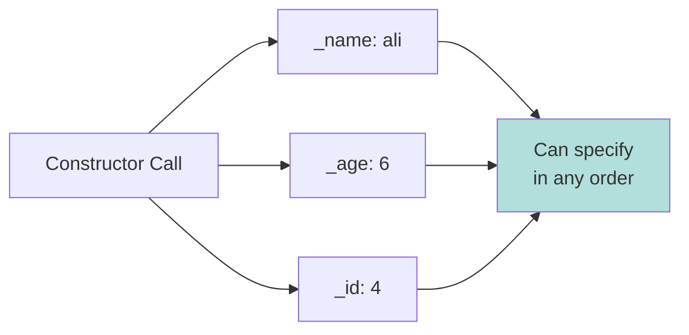

**Rules for Named Parameters:**

- Can mix positional and named
- Once you use named, all following must be named
- Example: `sum(1, 2, a:5)` ✅ - Positional then named
- Example: `sum(x:1, 2)` ❌ - Can't go back to positional after named

---

### 3. Params Keyword (Variable Arguments)

```csharp
public int sum(params int[] arr)
{
    int sum = 0;
    for (int i = 0; i < arr.Length; i++)
    {
        sum += arr[i];
    }
    return sum;
}

// Usage - Both work identically:
int s = op.sum(new int[] { 1, 2, 3, 4, 5 });
int s = op.sum(1, 2, 3, 4, 5, 33, 44, 55);
```

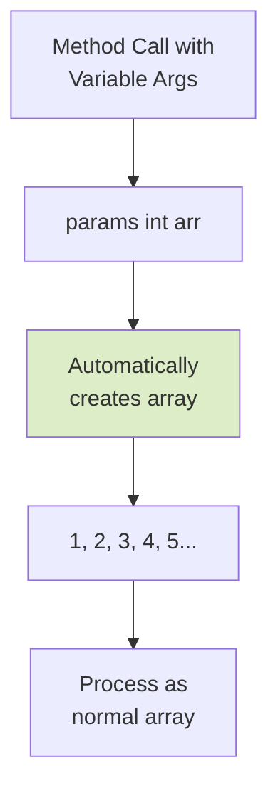

**Key Points:**

- Must be the **last parameter**
- Only **one params** parameter per method
- Can pass **zero or more** arguments
- Compiler creates array automatically

**Examples:**

```csharp
op.sum()                    // Valid - empty array
op.sum(5)                   // Valid - array with one element
op.sum(1, 2, 3, 4, 5)       // Valid - array with five elements
op.sum(new int[]{1,2,3})    // Valid - explicit array
```

---

## Exception Handling

### Exception Hierarchy

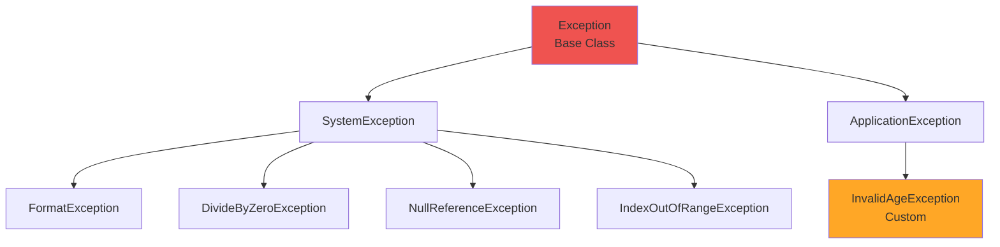

**Common Exception Types:**

|Exception|When It Occurs|Example|
|---|---|---|
|**FormatException**|Invalid string conversion|`int.Parse("abc")`|
|**DivideByZeroException**|Division by zero|`100 / 0`|
|**NullReferenceException**|Accessing null object|`string s = null; s.Length`|
|**IndexOutOfRangeException**|Invalid array index|`arr[100]` when arr length is 10|
|**ArgumentNullException**|Null argument passed|Method receives null when not expected|

---

### Try-Catch-Finally Structure

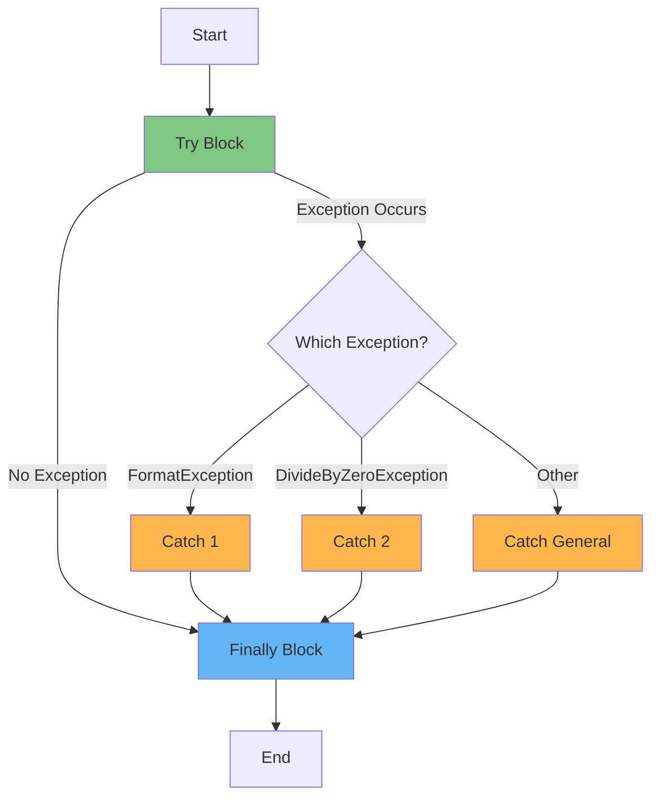

**Structure:**

- **Try Block**: Code that might throw an exception
- **Catch Block(s)**: Handle specific exceptions
- **Finally Block**: Always executes (cleanup code)

---

### Code Example with Multiple Catch Blocks

```csharp
try
{
    Console.WriteLine("enter number");
    int n = int.Parse(Console.ReadLine());
    int r = 100 / n;
    Console.WriteLine(r);
}
catch(FormatException ex)
{
    Console.WriteLine("invalid value");
}
catch(DivideByZeroException ex)
{
    Console.WriteLine("invalid operation: divide by zero");
}
catch(Exception ex)
{
    // Logging error
    Console.WriteLine(ex.InnerException);
    Console.WriteLine($"{DateTime.Now} \t {ex.Message} \t {ex.Source} \t {ex.StackTrace}");
}
finally
{
    Console.WriteLine("finally");
}
```

**Execution Flow Table:**

|Input|Exception Type|Caught By|Output|Finally Executes?|
|---|---|---|---|---|
|"abc"|FormatException|Catch 1|"invalid value"|✅ Yes|
|"0"|DivideByZeroException|Catch 2|"invalid operation..."|✅ Yes|
|"5"|None|-|"20"|✅ Yes|
|null|ArgumentNullException|Catch 3|Exception details|✅ Yes|

**Important Rules:**

1. **Order matters**: Catch specific exceptions before general `Exception`
2. **Finally always runs**: Even if exception occurs or not
3. **One catch executes**: Once caught, other catch blocks are skipped

---

### Exception Properties

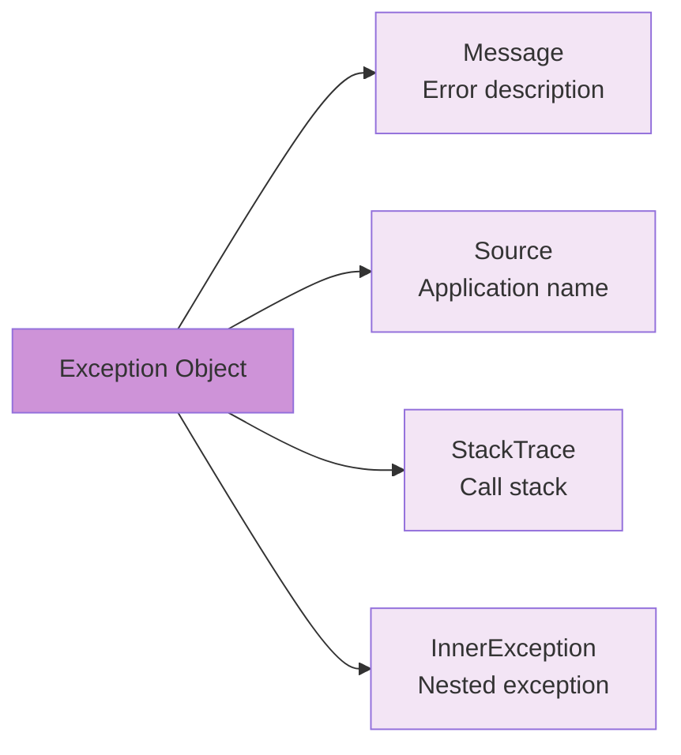

**Properties Explained:**

|Property|Description|Example|
|---|---|---|
|**Message**|Human-readable error description|"Input string was not in a correct format."|
|**Source**|Name of application/assembly|"Day5"|
|**StackTrace**|Method call sequence leading to error|"at Day5.Program.Main(String[] args) in..."|
|**InnerException**|Original exception if this is a wrapper|The underlying exception that caused this one|

**Logging Example:**

```csharp
catch(Exception ex)
{
    string logEntry = $"{DateTime.Now} \t {ex.Message} \t {ex.Source} \t {ex.StackTrace}";
    // Save to file or database for debugging
}
```

---

## Custom Exceptions

### Creating Custom Exception Class

```csharp
class InvalidAgeException : Exception
{
    public int agevalue { get; set; }
    
    public InvalidAgeException(int age)
        : base("error: invalid age, age must be between 20 and 60")
    {
        agevalue = age;
    }
}
```

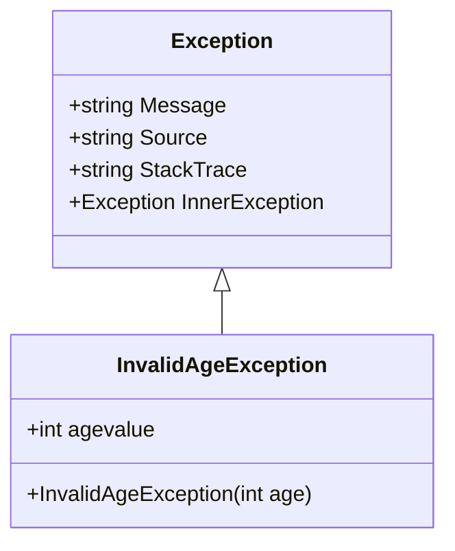

**Key Components:**

1. **Inherit from Exception**: `class InvalidAgeException : Exception`
2. **Call base constructor**: `: base("error message")`
3. **Add custom properties**: `public int agevalue { get; set; }`
4. **Store context data**: Save the invalid age value for debugging

---

### Using Custom Exception in Property

```csharp
class employee
{
    public int id { get; set; }
    public string name { get; set; }
    int age;
    
    public int Age
    {
        set
        {
            if (value > 20 && value < 60)
                age = value;
            else
                throw new InvalidAgeException(value);
        }
        get
        {
            return age;
        }
    }
}
```

**Property Validation Pattern:**

- Use **properties** to encapsulate validation logic
- **Throw custom exceptions** when validation fails
- Provide **meaningful error messages** to users

**Usage:**

```csharp
try
{
    employee em = new employee() { id = 1, name = "ali", Age = 18 };
}
catch(InvalidAgeException ex)
{
    Console.WriteLine(ex.agevalue); // Outputs: 18
    Console.WriteLine(ex.Message);   // Outputs: error: invalid age...
}
```

---

### Custom Exception Flow

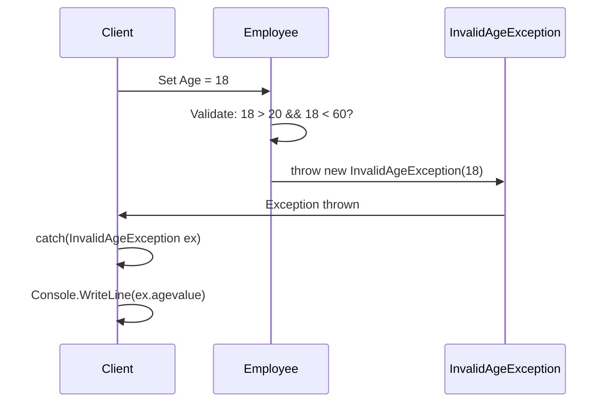

**Why Create Custom Exceptions?**

1. **Domain-specific errors**: Represent business rule violations
2. **Additional context**: Store relevant data (like the invalid age)
3. **Better error handling**: Catch specific business logic errors
4. **Clearer code**: Makes intent obvious to other developers

---

## Key Takeaways

### Parameter Passing Quick Reference

|Keyword|Initialize Before?|Assign Inside?|Can Modify?|Use Case|
|---|---|---|---|---|
|**none**|✅|❌|❌|Default (copy)|
|**ref**|✅|❌|✅|Modify original|
|**out**|❌|✅|✅|Return multiple|
|**in**|✅|❌|❌|Performance + safety|
|**params**|-|-|✅|Variable args|

### Exception Handling Best Practices

1. **Catch specific exceptions first**, general exceptions last
2. **Always include finally** for cleanup (closing files, connections)
3. **Log exceptions** with timestamp, message, source, and stack trace
4. **Create custom exceptions** for domain-specific errors
5. **Validate input** to prevent exceptions when possible
6. **Don't catch exceptions** you can't handle meaningfully
7. **Use try-catch around** risky operations (I/O, parsing, database)

### Method Parameter Best Practices

1. **Use `out`** when returning multiple values
2. **Use `ref`** when you need to modify the original value
3. **Use `in`** for large structs to avoid copying
4. **Use `params`** for flexible argument count
5. **Use default parameters** to reduce overloads
6. **Use named parameters** for clarity with many parameters

---

## Practice Questions

### Understanding Check

1. **What happens if you pass an array to a method without `ref` and modify its elements?**
    
    - The elements ARE modified (arrays are reference types)
    - But the array reference itself cannot be changed
2. **Why must `out` parameters be assigned before the method returns?**
    
    - Because `out` promises to return a value
    - Compiler enforces this to prevent uninitialized variables
3. **When would you use `params` instead of accepting an array parameter?**
    
    - When you want flexibility in calling syntax
    - Makes the method easier to call without creating arrays explicitly
4. **Why should specific exceptions be caught before general `Exception`?**
    
    - More specific handlers should run first
    - Prevents general handler from catching everything
5. **What's the difference between throwing `Exception` vs custom `InvalidAgeException`?**
    
    - Custom exception provides domain-specific context
    - Allows catching specific business rule violations
    - Can include additional data (like the invalid age value)

### Code Analysis Exercises

**Exercise 1:** What's the output?

```csharp
int x = 5, y = 10;
swap(ref x, ref y);
Console.WriteLine($"{x}, {y}");
```

**Exercise 2:** Will this compile?

```csharp
public void method(out int x)
{
    // x = 5; (commented out)
    return;
}
```

**Exercise 3:** What values are returned?

```csharp
int sum, mul, sub;
sum = calc(10, 5, out mul, out sub);
// sum = ?, mul = ?, sub = ?
```

---

## Summary Diagram

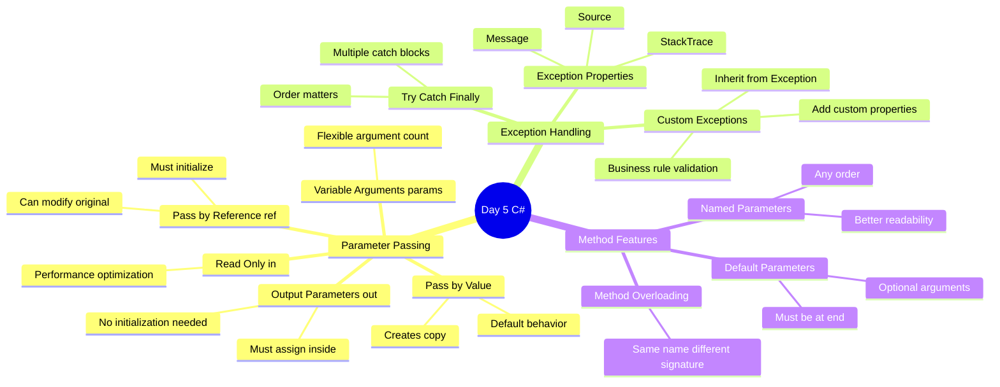

---

## Additional Notes

### When NOT to Use Exceptions

- **Expected conditions**: Use return values or bool flags
- **Control flow**: Don't use exceptions for normal program flow
- **Performance-critical code**: Exceptions are expensive

### When to Use Exceptions

- **Unexpected errors**: File not found, network failure
- **Validation failures**: Invalid input, business rule violations
- **External system failures**: Database connection, API calls

### Memory Diagram: Value vs Reference

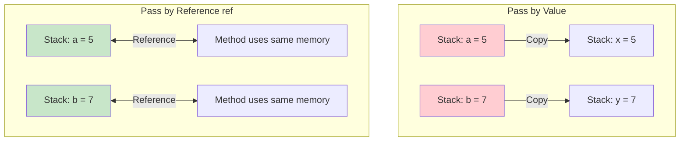

---

_End of Study Guide_