# C# Object-Oriented Programming - Day 4 Lecture Notes

## Table of Contents

1. [[#Struct vs Class]]
2. [[#Properties in C#]]
3. [[#Constructors]]
4. [[#Object Initialization]]
5. [[#Destructors]]
6. [[#Object Class Methods]]
7. [[#Reference vs Value Types]]
8. [[#Key Concepts Summary]]
9. [[#Practice Questions]]

---

## Struct vs Class

### Key Differences

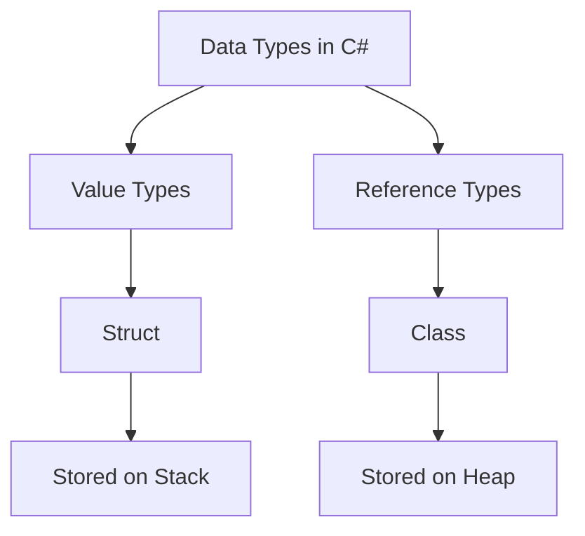

### Memory Allocation

**Struct (Value Type)**

- Stored directly on the **stack**
- Contains the actual data
- Copied by value when assigned
- Lightweight and fast

**Class (Reference Type)**

- Stored on the **heap**
- Variable contains a reference (pointer) to the data
- Copied by reference when assigned
- More flexible for large objects

### Code Example Comparison

Both `ComplexNum` implementations (struct and class) have identical syntax, but behave differently:

```csharp
// As Struct - Value Type
struct ComplexNum 
{ 
    public int Img { set; get; }
    public int Real { set; get; }
    // ... methods ...
}

// As Class - Reference Type
class ComplexNum 
{ 
    public int Img { set; get; }
    public int Real { set; get; }
    // ... methods ...
}
```

> [!tip] When to Use Which?
> 
> - **Struct**: Small data (< 16 bytes), immutable values, short-lived
> - **Class**: Complex objects, inheritance needed, large data

---

## Properties in C Sharp

### Types of Properties

#### 1. Full Property (Manual Backing Field)

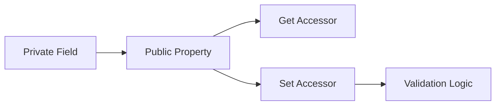

**Example from code:**

```csharp
int real;  // backing field (private)

public int Real
{
    set
    {
        if (value > 0) 
            real = value;
        else 
            throw new Exception("invalid real value");
    }
    get
    {
        return real;
    }
}
```

**Purpose:** Add validation or custom logic when getting/setting values

> [!note] The `value` Keyword In the `set` accessor, `value` is an implicit parameter containing the value being assigned

#### 2. Automatic Properties

```csharp
public int Img { set; get; }  // Compiler creates backing field automatically
public int Real { set; get; }
```

**Features:**

- Compiler automatically creates a private backing field
- Simpler syntax for basic properties
- No custom logic in accessors
- Most commonly used

#### 3. Init-Only Properties

```csharp
public int Img { init; get; }  // Can only be set during initialization
public int Real { init; get; }
```

**Usage:** For immutable objects (cannot be changed after creation)

**Example:**

```csharp
ComplexNum c = new ComplexNum() { Real = 3, Img = 4 };
// c.Real = 5;  // ERROR! Cannot modify after initialization
```

---

## Constructors

### Purpose

Initialize object state when it's created

### Types Demonstrated

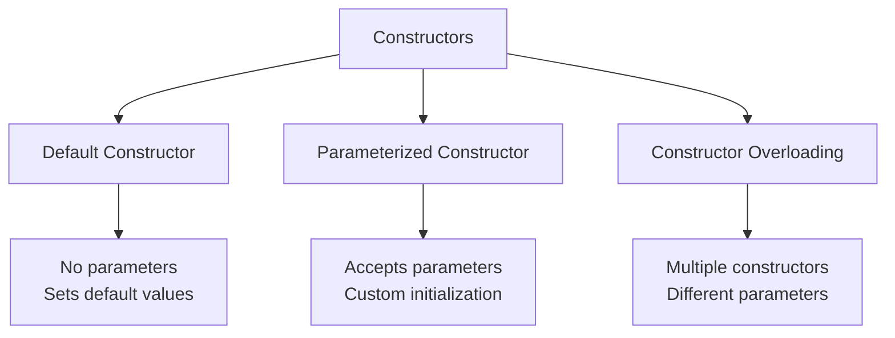

### Code Examples

#### 1. Default Constructor (No Parameters)

```csharp
public ComplexNum()
{
    Real = 1;
    Img = 1;
}
```

**Called when:**

```csharp
ComplexNum c = new ComplexNum();
// Output: 1+1i
```

#### 2. Parameterized Constructor (Two Parameters)

```csharp
public ComplexNum(int _real, int _img)
{
    Real = _real;
    Img = _img;
}
```

**Called when:**

```csharp
ComplexNum c = new ComplexNum(3, 4);
// Output: 3+4i
```

#### 3. Parameterized Constructor (One Parameter)

```csharp
public ComplexNum(int _real)
{
    Real = _real;
    // Img uses default value (0)
}
```

**Called when:**

```csharp
ComplexNum c = new ComplexNum(3);
// Output: 3+0i
```

> [!important] Constructor Overloading You can have multiple constructors with different parameters. The compiler chooses the correct one based on the arguments you pass.

---

## Object Initialization

### Three Ways to Initialize Objects

#### 1. Traditional Way (Separate Statements)

```csharp
ComplexNum c = new ComplexNum();
c.Real = 3;
c.Img = 2;
```

#### 2. Object Initializer Syntax

```csharp
ComplexNum c = new ComplexNum() { Real = 3, Img = 4 };
```

#### 3. Constructor + Initializer Combined

```csharp
ComplexNum c = new ComplexNum(3) { Img = 4 };
// Constructor sets Real = 3, initializer sets Img = 4
```

#### 4. Target-Typed New Expression (C# 9+)

```csharp
ComplexNum c = new() { Real = 3, Img = 4 };
// Type inferred from variable declaration
```

### Execution Order

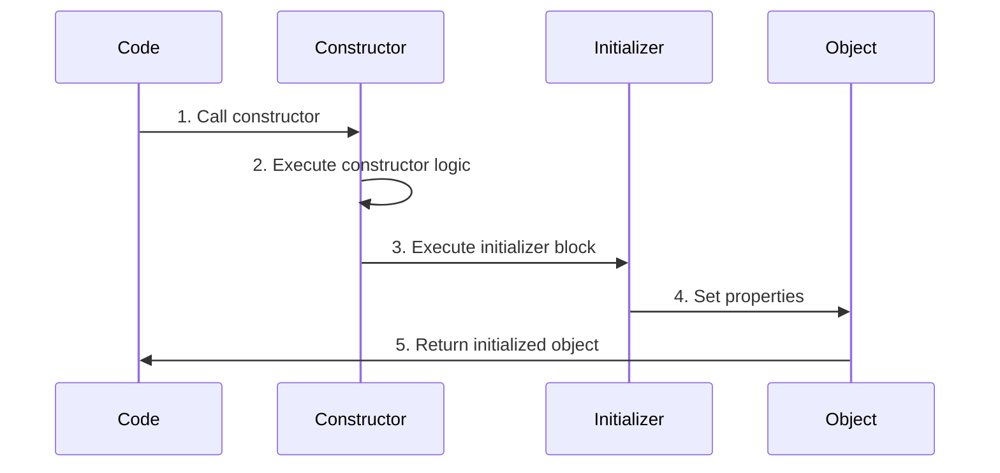

> [!example] Execution Example
> 
> ```csharp
> ComplexNum c = new ComplexNum(5) { Img = 10 };
> // Step 1: Constructor sets Real = 5, Img = 0
> // Step 2: Initializer sets Img = 10
> // Final result: Real = 5, Img = 10
> ```

---

## Destructors

### Syntax

```csharp
~ComplexNum()
{
    Console.WriteLine("destructor called");
}
```

### Characteristics

- Called automatically when object is **garbage collected**
- **Cannot** be called manually
- **Cannot** have parameters
- **Cannot** be overloaded (only one destructor per class)
- Only available in **classes**, NOT in structs
- Used for cleanup (closing files, releasing resources)
- Rare in C# due to automatic garbage collection

### Destructor vs Garbage Collection Flow


> [!warning] Non-Deterministic Timing You cannot predict WHEN the destructor will be called. The garbage collector decides this automatically.

---

## Object Class Methods

### The Object Class Hierarchy

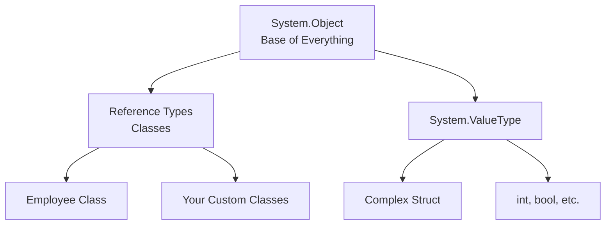

**Key Concept:** ALL types in C# inherit from `System.Object` (either directly or indirectly)

### Methods Inherited from Object

#### 1. ToString()

**Purpose:** Convert object to string representation

**Default Behavior:** Returns the fully qualified type name

**Override Example:**

```csharp
// Complex Struct
public override string ToString()
{
    return $"{real}+{img}i";
}

// Employee Class
public override string ToString()
{
    return $"{id}-{name}-{age} years old";
}
```

**Usage:**

```csharp
Complex c = new Complex() { img = 2, real = 4 };
Console.WriteLine(c.ToString());  // Output: 4+2i

Employee em = new Employee() { id = 1, name = "ahmed", age = 20 };
Console.WriteLine(em.ToString()); // Output: 1-ahmed-20 years old
```

> [!tip] Implicit ToString() When you use an object in string interpolation or `Console.WriteLine()`, `ToString()` is called automatically:
> 
> ```csharp
> Console.WriteLine(c);  // Same as Console.WriteLine(c.ToString())
> ```

---

#### 2. Equals()

**Purpose:** Compare two objects for equality

**Default Behavior:**

- **Classes:** Compares references (are they the same object in memory?)
- **Structs:** Compares all fields (are the values the same?)

**Override for Custom Equality Logic:**

```csharp
public override bool Equals(object? obj)
{
    Employee em = (Employee)obj;
    return (id == em.id && name == em.name && age == em.age);
}
```

**Comparison Flow:**

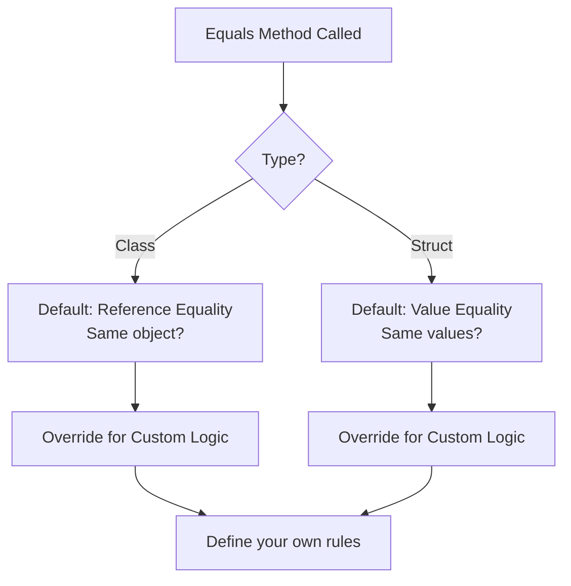

**Example Without Override (Classes):**

```csharp
Employee em1 = new Employee() { id = 1, name = "ali", age = 20 };
Employee em2 = new Employee() { id = 1, name = "ali", age = 20 };

if (em1.Equals(em2))  // FALSE - different objects in memory
    Console.WriteLine("equal");
else
    Console.WriteLine("not equal");  // This executes
```

**Example With Override:**

```csharp
// After overriding Equals() to compare id, name, and age
if (em1.Equals(em2))  // TRUE - same values
    Console.WriteLine("equal");  // This executes
```

**Struct Equality (Value Type):**

```csharp
Complex c1 = new Complex() { real = 1, img = 2 };
Complex c2 = new Complex() { real = 1, img = 2 };

if (c1.Equals(c2))  // TRUE - structs compare by value automatically
    Console.WriteLine("equal");  // This executes
```

---

#### 3. GetHashCode()

**Purpose:** Returns an integer hash code representing the object

**Uses:**

- Used in hash-based collections (`Dictionary`, `HashSet`, `Hashtable`)
- Enables fast lookup and comparison
- Must be consistent with `Equals()`

**Override Example:**

```csharp
public override int GetHashCode()
{
    return id;  // Use ID as the hash code
}
```

**Important Rules:**

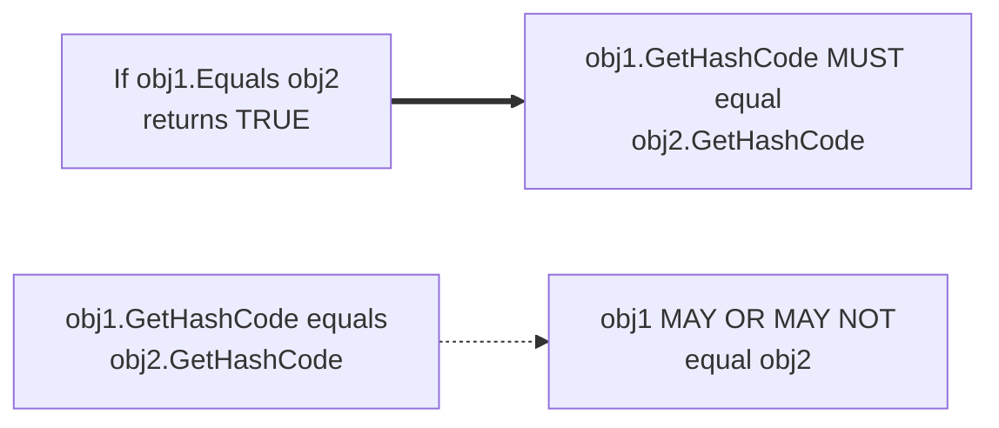

> [!important] Hash Code Contract
> 
> - If two objects are equal (via `Equals()`), they MUST have the same hash code
> - If two objects have the same hash code, they might NOT be equal (hash collisions are allowed)
> - Always override `GetHashCode()` when you override `Equals()`

**Example:**

```csharp
Employee em = new Employee() { id = 2, name = "ali" };
Employee em1 = em;  // Both reference the same object

Console.WriteLine(em.GetHashCode());   // e.g., 2
Console.WriteLine(em1.GetHashCode());  // e.g., 2 (same object, same hash)
```

---

#### 4. GetType()

**Purpose:** Returns runtime type information (`Type` object)

**Usage:** Get metadata about the object's type

**Example:**

```csharp
Employee emp = new Employee();
Console.WriteLine(emp.GetType());          // Output: Day4PII.Employee
Console.WriteLine(emp.GetType().Name);     // Output: Employee
Console.WriteLine(emp.GetType().BaseType); // Output: System.Object

Complex c = new Complex();
Console.WriteLine(c.GetType());                  // Output: Day4PII.Complex
Console.WriteLine(c.GetType().BaseType);         // Output: System.ValueType
Console.WriteLine(c.GetType().BaseType.BaseType); // Output: System.Object
```

**Type Hierarchy Visualization:**

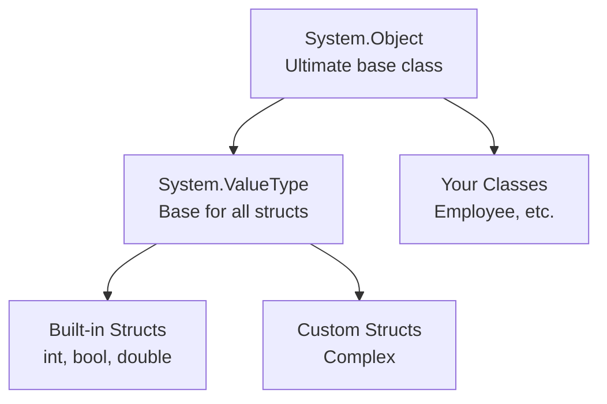

> [!note] Reflection `GetType()` is the entry point to **reflection** - examining and manipulating types at runtime

---

## Reference vs Value Types

### Memory Behavior Comparison

#### Value Types (Struct)

```csharp
Complex c1 = new Complex() { real = 1, img = 2 };
Complex c2 = c1;  // COPIES the values
c2.real = 5;      // c1.real is still 1 (independent copy)

Console.WriteLine(c1.real);  // Output: 1
Console.WriteLine(c2.real);  // Output: 5
```

**Memory Diagram:**

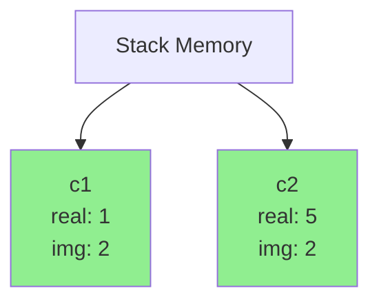

---

#### Reference Types (Class)

```csharp
Employee em = new Employee() { id = 2, name = "ali" };
Employee em1 = em;  // COPIES the reference (both point to same object)
em1.id = 4;         // em.id is also 4 (same object!)

Console.WriteLine(em.id);   // Output: 4
Console.WriteLine(em1.id);  // Output: 4
```

**Memory Diagram:**

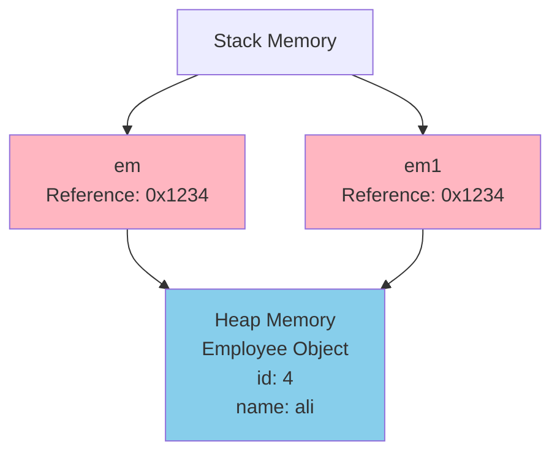

**Hash Code Example Demonstrates Reference:**

```csharp
Employee em = new Employee() { id = 2, name = "ali" };
Employee em1 = em;

Console.WriteLine(em.GetHashCode());   // e.g., 46104728
Console.WriteLine(em1.GetHashCode());  // e.g., 46104728 (SAME - same object!)

// Modifying through either reference affects both
em.id = 10;
Console.WriteLine(em1.id);  // Output: 10
```

---

### Visual Comparison

|Aspect|Struct (Value Type)|Class (Reference Type)|
|---|---|---|
|**Storage**|Stack|Heap (reference on stack)|
|**Assignment**|Copies all data|Copies reference only|
|**Independence**|Independent copies|Shared object|
|**Performance**|Faster (no heap allocation)|Slower (heap allocation + GC)|
|**Null**|Cannot be null (unless `Nullable<T>`)|Can be null|
|**Inheritance**|Cannot inherit from structs|Supports inheritance|
|**Destructor**|Not allowed|Allowed|

---

## Key Concepts Summary

### When to Use Struct vs Class

|Use Struct When...|Use Class When...|
|---|---|
|Small data structures|Complex objects with behavior|
|Immutable data preferred|Mutable objects needed|
|Short-lived objects|Long-lived objects|
|Size < 16 bytes recommended|Any size|
|Value semantics desired|Reference semantics desired|
|No inheritance needed|Inheritance required|
|Examples: Point, Color, Complex|Examples: Employee, Customer, Order|

---

### The `object` Type (Universal Base)

The `object` type can hold ANY type in C#:

```csharp
object obj = new Employee();  // Reference type
obj = 1;                       // Value type (boxed)
obj = new Complex();           // Value type (boxed)
obj = "ali";                   // Reference type

// Array of objects can hold anything
object[] arr = new object[4];
arr[0] = 1;
arr[1] = new Employee();
arr[2] = "text";
arr[3] = new Complex();
```

> [!info] Boxing and Unboxing
> 
> - **Boxing**: Converting value type to `object` (value → reference)
> - **Unboxing**: Converting `object` back to value type (reference → value)
> - This has performance overhead

---

### Method Signatures vs Headers

**From the code comments:**

```csharp
// Header: public string getstring(int x)
// Signature: string(int)
```

**Definitions:**

- **Header:** Full method declaration including access modifier, return type, name, and parameters
- **Signature:** Return type + parameter types only (used for method overloading)

**Why Signatures Matter:**

```csharp
// These have DIFFERENT signatures (overloading allowed)
public void DoWork(int x) { }
public void DoWork(string s) { }
public void DoWork(int x, int y) { }

// These have the SAME signature (compilation error)
public void DoWork(int x) { }
public int DoWork(int y) { }  // ERROR! Only return type differs
```

---

## Practice Questions

### Basic Understanding

1. What happens when you assign one class object to another variable?
2. What happens when you assign one struct to another variable?
3. Why would you override `ToString()`?
4. When must you override `GetHashCode()`?

### Properties

5. What's the difference between `{ set; get; }` and `{ init; get; }`?
6. Why would you use a full property with backing field instead of automatic property?

### Type System

7. Can a struct have a destructor? Why or why not?
8. What is the base type of all classes in C#?
9. What is the base type of all structs in C#?

### Memory & Behavior

10. If you have two `Employee` objects with identical data, will `Equals()` return true by default?
11. If you have two `Complex` structs with identical data, will `Equals()` return true by default?
12. Why do `em` and `em1` have the same hash code in the last example?

---

## Additional Notes

### Polymorphism with Object

The `object` type demonstrates **polymorphism** - one variable type can hold many different object types:

```csharp
object o1 = 2;                    // int
object o2 = new Employee();       // Employee
object o3 = "text";               // string
object o4 = new Complex();        // Complex

// But you lose type-specific functionality
// o2.id;  // ERROR! object doesn't have 'id' property
// Need to cast back:
Employee e = (Employee)o2;
Console.WriteLine(e.id);  // Now works
```

### Best Practices

1. **Always override `ToString()`** for better debugging and display
2. **Override `Equals()` and `GetHashCode()` together** for proper equality
3. **Use automatic properties** unless you need validation
4. **Prefer classes over structs** unless you have specific performance needs
5. **Don't rely on destructors** - use `IDisposable` pattern instead

---

## Summary Diagram

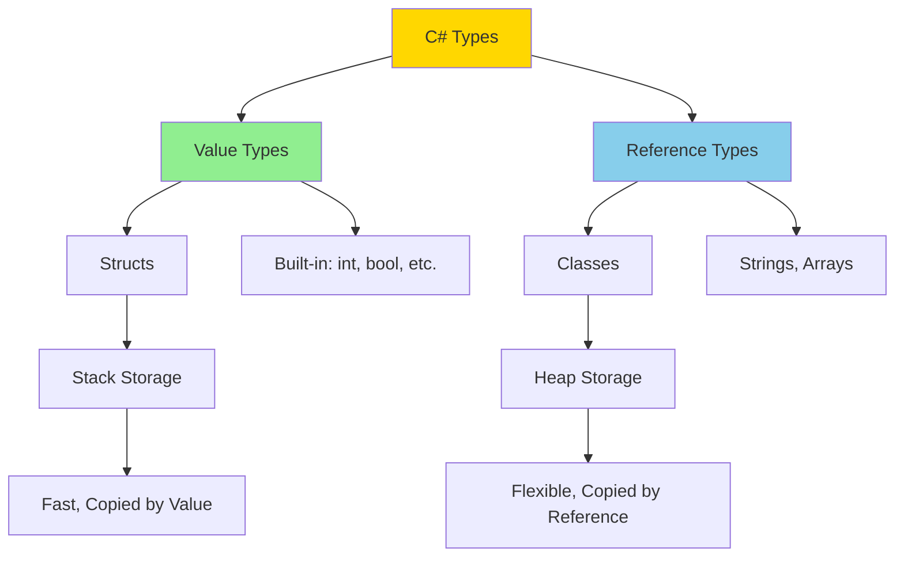

---

_These notes cover the fundamental concepts of structs, classes, properties, constructors, and the Object class methods in C#. Practice writing code examples to reinforce these concepts!_