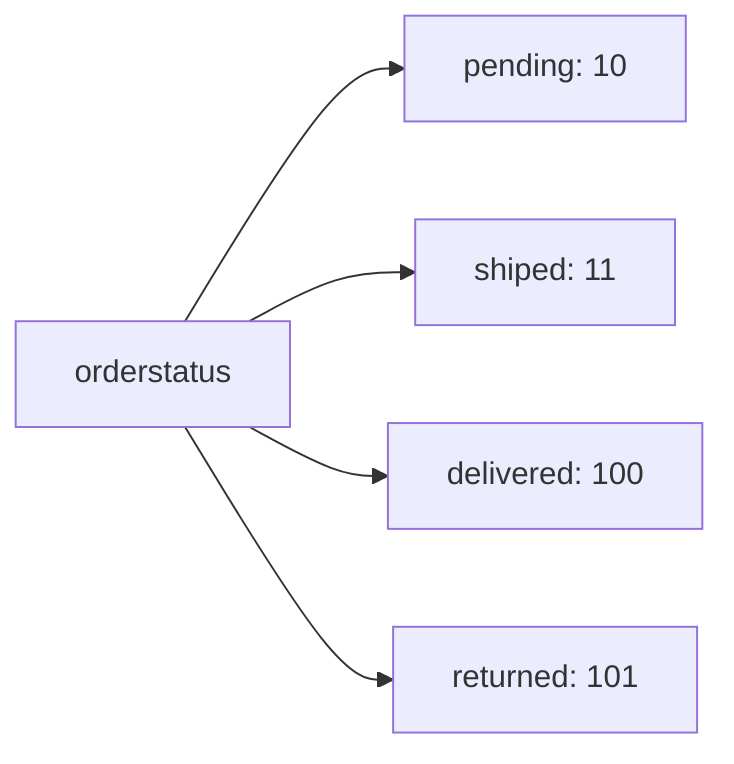
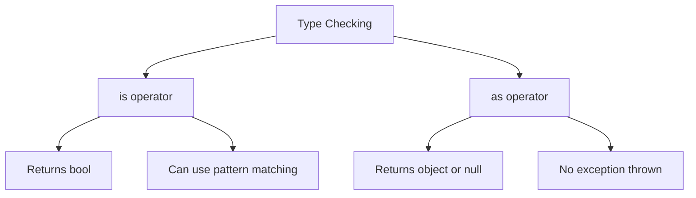
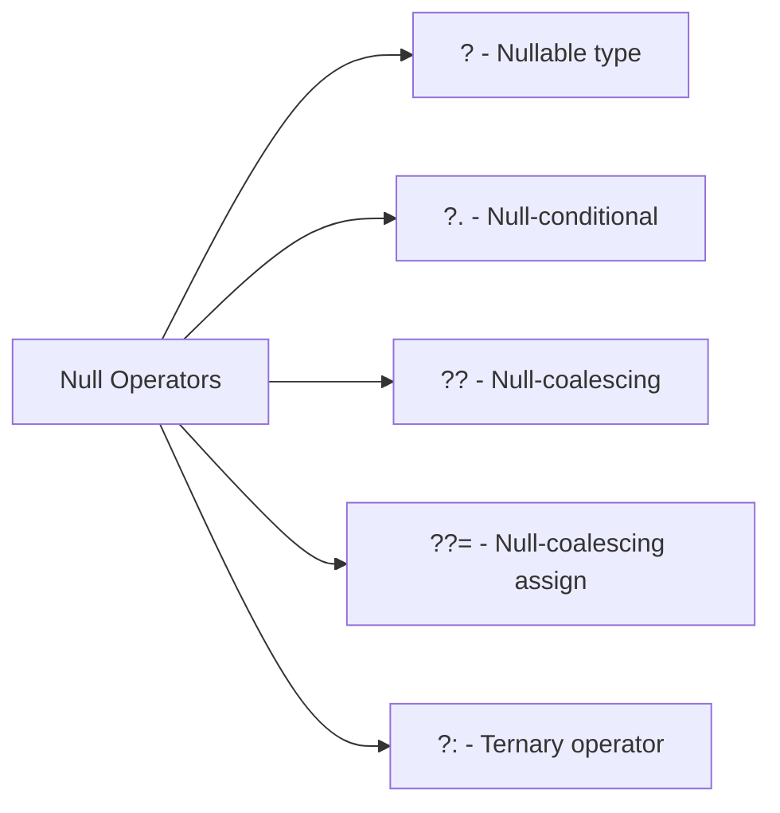
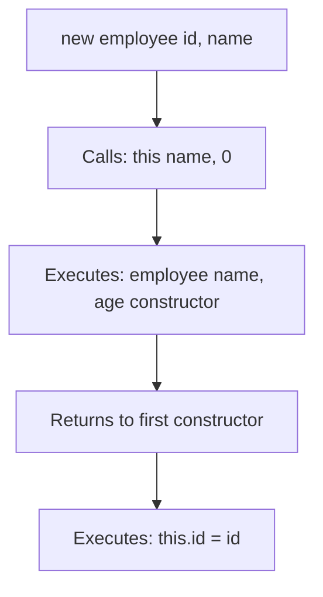

# C# Day 6 - Advanced Concepts Study Guide

## 📚 Table of Contents

1. [Enumerations (Enums)](#enumerations-enums)
2. [Checked & Unchecked Operations](#checked--unchecked-operations)
3. [Type Parsing & Conversion](#type-parsing--conversion)
4. [Type Checking (is & as)](#type-checking-is--as)
5. [Null Safety Operators](#null-safety-operators)
6. [Object Methods Override](#object-methods-override)
7. [Static Members](#static-members)
8. [Constructor Chaining](#constructor-chaining)

---

## 🔢 Enumerations (Enums)

### What are Enums?

Enums are **named constants** that make code more readable and maintainable. Instead of using magic numbers, you give meaningful names to values.

### Basic Enum

```csharp
enum gender
{
    male,    // 0 by default
    female   // 1 by default
}
```

**Usage:**

```csharp
gender g = gender.male;
g = gender.female;
Console.WriteLine(g);  // Output: female
```

### Enum with Custom Values

```csharp
enum orderstatus : byte
{
    pending = 10,
    shiped = 11,      // Auto-increments from previous
    delivered = 100,
    returned = 101    // Auto-increments from previous
}
```

**Key Points:**

- You can specify the underlying type (`: byte`, `: int`, etc.)
- Default type is `int`
- Values auto-increment if not specified

### Visual Representation



### Flags Enum (Bit Flags)

```csharp
[Flags]
enum prev : byte
{
    admin = 1,       // 0001
    instructor = 2,  // 0010
    student = 4,     // 0100
    supervisor = 8,  // 1000
    manager = 16     // 10000
}
```

**Combining Flags:**

```csharp
// Using XOR (^) to combine
prev p = prev.admin ^ prev.student ^ prev.instructor;
// Result: 1 ^ 4 ^ 2 = 7 (0111 in binary)
```

**Common Flag Operations:**

- `|` (OR) - Add a flag
- `&` (AND) - Check if flag exists
- `^` (XOR) - Toggle a flag
- `~` (NOT) - Remove a flag

### Enum Parsing

```csharp
// Parse from string (throws exception if invalid)
orderstatus o1 = Enum.Parse<orderstatus>("pending");

// TryParse (safe parsing, returns bool)
bool status = Enum.TryParse<orderstatus>("delivered", out orderstatus o2);
```

### Enum Type Casting

```csharp
// Cast from int to enum
orderstatus o = (orderstatus)107;  // Works even for undefined values
```

---

## ✅ Checked & Unchecked Operations

### The Problem: Integer Overflow

When integers exceed their maximum value, they **wrap around** to the minimum value.

```csharp
uint x = uint.MaxValue;  // 4,294,967,295
x = x + 10;              // Wraps to 9 (overflow!)
```

### Checked Block

Forces overflow checking - **throws exception** on overflow:

```csharp
checked
{
    int x = int.MaxValue;
    x = x + 10;  // OverflowException thrown!
}
```

### Unchecked Block

Allows overflow without exception (default behavior):

```csharp
unchecked
{
    uint x = uint.MaxValue;
    x = x + 10;  // Wraps around, no exception
}
```

### Visual Diagram

```
┌─────────────────────────────────────┐
│    uint.MaxValue (4,294,967,295)   │
├─────────────────────────────────────┤
│  + 10                               │
├─────────────────────────────────────┤
│  Unchecked: wraps to 9              │
│  Checked:   throws exception ❌     │
└─────────────────────────────────────┘
```

---

## 🔄 Type Parsing & Conversion

### Parse vs TryParse

|Method|Behavior on Invalid Input|Return Type|
|---|---|---|
|`Parse()`|Throws exception ❌|Direct value|
|`TryParse()`|Returns `false` ✅|`bool` + `out` parameter|

### Using Parse (Risky)

```csharp
Console.WriteLine("Enter number:");
int x = int.Parse(Console.ReadLine());  // Exception if invalid!
```

### Using TryParse (Safe)

```csharp
Console.WriteLine("Enter number:");
bool status = int.TryParse(Console.ReadLine(), out int x);
Console.WriteLine($"status={status}, x={x}");
```

### Validation Loop Pattern

```csharp
int x;
bool status = false;
do
{
    Console.Clear();
    Console.WriteLine("Enter number:");
    status = int.TryParse(Console.ReadLine(), out x);
}
while (status == false);  // Keep asking until valid
```

---

## 🔍 Type Checking (is & as)

### The `is` Operator

Checks if an object is of a specific type.

#### Traditional Usage

```csharp
object obj = 123;
if (obj is int)
{
    int x = (int)obj;  // Manual cast needed
    Console.WriteLine(x);
}
```

#### Pattern Matching (Modern C#)

```csharp
object obj = 123;
if (obj is int x)  // Declares variable if match succeeds
{
    Console.WriteLine(x);  // x is already an int!
}
```

### The `as` Operator

Attempts to cast; returns `null` if it fails (no exception).

```csharp
object obj = new employee() { id = 12 };
obj = 123;  // Now obj is an int, not employee

employee em = obj as employee;  // em will be null
if (em != null)
{
    // Safe to use em
}
```

### Comparison Table

|Operator|Returns|On Failure|Use Case|
|---|---|---|---|
|`is`|`bool`|`false`|Type checking|
|`as`|Object or `null`|`null`|Safe casting|



---

## 🛡️ Null Safety Operators

### Nullable Value Types

```csharp
int? x = null;  // Shorthand for Nullable<int>
```

### Null-Conditional Operator (`?.` and `?[]`)

Safely access members only if the object is not null.

#### Array/Property Access

```csharp
int[] arr = null;
int? length = arr?.Length;  // length = null (no exception!)

arr = new int[] { 1, 2, 3 };
length = arr?.Length;  // length = 3
```

#### Array Indexing

```csharp
int[] arr = { 3, 4, 5 };
int? first = arr?[0];  // first = 3

arr = null;
first = arr?[0];  // first = null (no exception!)
```

### Null-Coalescing Operator (`??`)

Provides a default value if the expression is null.

```csharp
string txt = null;
string txt2 = txt ?? "hi";  // txt2 = "hi"

txt = "hello";
txt2 = txt ?? "hi";  // txt2 = "hello"
```

**Equivalent to:**

```csharp
string txt2;
if (txt != null)
    txt2 = txt;
else
    txt2 = "hi";
```

### Null-Coalescing Assignment (`??=`)

Assigns a value only if the variable is null.

```csharp
string txt = null;
txt ??= "hi";  // txt = "hi"

txt ??= "bye";  // txt stays "hi" (not null)
```

**Equivalent to:**

```csharp
if (txt == null)
    txt = "hi";
```

### Ternary Operator (`?:`)

Conditional expression.

```csharp
int x = 5;
int y = (x > 5) ? x : 10;  // y = 10
```

**Equivalent to:**

```csharp
int y;
if (x > 5)
    y = x;
else
    y = 10;
```

### Operator Summary



---

## 🔄 Object Methods Override

### The Equals Method

By default, `Equals()` checks **reference equality** (same memory location).

#### Default Behavior

```csharp
employee em = new employee() { id = 4 };
employee em2 = new employee() { id = 4 };

em.Equals(em2);  // FALSE (different objects in memory)
```

#### Custom Equals (Commented Out in Code)

```csharp
public override bool Equals(object obj)
{
    // Using 'as' operator
    employee em = obj as employee;
    if (em == null) 
        return false;
    else
        return (id == em.id);
}
```

**Alternative using `is`:**

```csharp
public override bool Equals(object obj)
{
    if (obj is employee em)
    {
        return (id == em.id);
    }
    else
        return false;
}
```

### Visual Representation

```
Default Equals:
┌─────────────┐     ┌─────────────┐
│ em (id=4)   │     │ em2 (id=4)  │
│ Memory: 0x1 │  ≠  │ Memory: 0x2 │
└─────────────┘     └─────────────┘
Result: FALSE

Custom Equals:
┌─────────────┐     ┌─────────────┐
│ em (id=4)   │     │ em2 (id=4)  │
│ Compares ID │  =  │ Compares ID │
└─────────────┘     └─────────────┘
Result: TRUE
```

---

## 🔒 Static Members

### What is Static?

**Static members** belong to the **class itself**, not to individual instances.

### Static Field Example

```csharp
class employee
{
    public int id { get; set; }
    public string name { get; set; }
    public int age { get; set; }
    
    public static int count = 0;  // Shared across all instances
    
    public employee(string name, int age)
    {
        count++;            // Increment shared counter
        this.id = count;    // Use counter for ID
        this.name = name;
        this.age = age;
    }
}
```

### Usage

```csharp
employee em = new employee("ahmed", 22);
employee em2 = new employee("ali", 22);

Console.WriteLine(em);   // 1-ahmed-22
Console.WriteLine(em2);  // 2-ali-22
```

### Memory Diagram

```
Class Level (Static):
┌─────────────────┐
│ count = 2       │ ← Shared by all instances
└─────────────────┘

Instance Level:
┌─────────────────┐      ┌─────────────────┐
│ em              │      │ em2             │
│ id = 1          │      │ id = 2          │
│ name = "ahmed"  │      │ name = "ali"    │
│ age = 22        │      │ age = 22        │
└─────────────────┘      └─────────────────┘
```

### Key Differences

|Feature|Instance|Static|
|---|---|---|
|Belongs to|Object|Class|
|Access via|Object reference|Class name|
|Memory|One per object|One for all objects|
|Keyword|(none)|`static`|

---

## 🔗 Constructor Chaining

### Using `this` Keyword

Calls another constructor in the same class.

### Example (Commented in Code)

```csharp
public employee(string name, int age)
{
    count++;
    this.id = count;
    this.name = name;
    this.age = age;
}

// Constructor chaining
public employee(int id, string name) : this(name, 0)
{
    this.id = id;  // Override the ID
}
```

### How It Works



### Benefits

- **Reduces code duplication**
- **Centralizes initialization logic**
- **Maintains consistency**

---

## 📝 ToString Override

Makes object printing more readable.

```csharp
public override string ToString()
{
    return $"{id}-{name}-{age}";
}
```

**Without override:**

```csharp
Console.WriteLine(em);  // Output: Day6PII.employee
```

**With override:**

```csharp
Console.WriteLine(em);  // Output: 1-ahmed-22
```

---

## 🎯 Key Takeaways

### Enums

- Use enums for named constants
- `[Flags]` for combinable options
- Use `TryParse` for safe string conversion

### Safety Features

- `checked`/`unchecked` for overflow control
- `TryParse` instead of `Parse` for input validation
- `is`/`as` for safe type checking
- Null operators (`?.`, `??`, `??=`) prevent null exceptions

### Object-Oriented Features

- Override `Equals()` for value comparison
- Override `ToString()` for readable output
- Use `static` for shared class-level data
- Use constructor chaining to avoid duplication

---

## 💡 Best Practices

1. **Always use `TryParse`** for user input
2. **Use enums** instead of magic numbers
3. **Leverage null operators** to write cleaner code
4. **Override `Equals`** when comparing by value
5. **Use `static`** for counters, configurations, utilities
6. **Chain constructors** to keep code DRY (Don't Repeat Yourself)

---

## 🔍 Practice Questions

1. What's the difference between `int.Parse()` and `int.TryParse()`?
2. When would you use the `[Flags]` attribute on an enum?
3. What does `string txt = null; txt ??= "default";` do?
4. Why would you override the `Equals()` method?
5. What's the difference between instance and static members?

---

_Last Updated: Day 6 Session Notes_