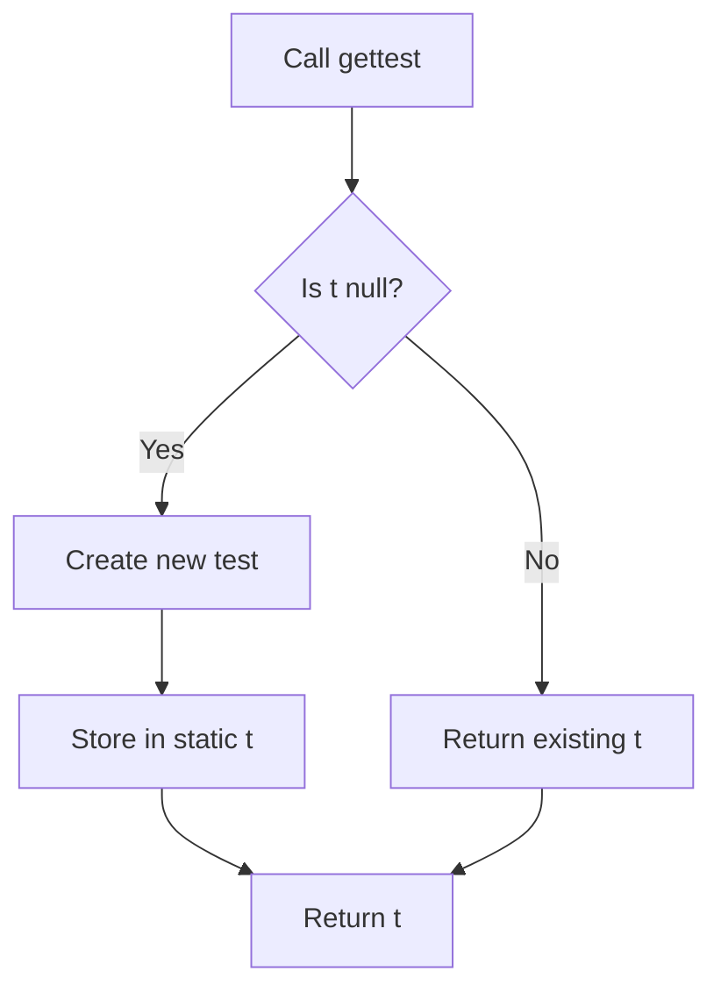

# C# Day 7: Advanced OOP Concepts

## Table of Contents

1. [Operator Overloading](#operator-overloading)
2. [User-Defined Casting](#user-defined-casting)
3. [Indexers](#indexers)
4. [Singleton Pattern](#singleton-pattern)
5. [StringBuilder](#stringbuilder)

---

## Operator Overloading

### What is Operator Overloading?

Operator overloading allows you to define custom behavior for operators (+, -, ++, ==, etc.) when used with your own types.

### Syntax

```csharp
public static ReturnType operator OperatorSymbol(Parameters)
{
    // Implementation
}
```

### Example: Complex Number Class

```csharp
struct complex
{
    public int real { get; set; }
    public int img { get; set; }
}
```

#### Visual Representation

```
Complex Number: a + bi
Where:
  a = real part
  b = imaginary part
  i = √(-1)

Example: 3 + 4i
         ↓   ↓
       real img
```

### Binary Operator Overloading

#### Addition of Two Complex Numbers

```csharp
public static complex operator +(complex a, complex b)
{
    return new complex(a.real + b.real, a.img + b.img);
}
```

**Visual Example:**

```
  (3 + 4i) + (2 + 5i)
     ↓         ↓
  real: 3+2 = 5
  img:  4+5 = 9
     ↓
  Result: 5 + 9i
```

#### Addition of Complex Number and Integer

```csharp
public static complex operator +(complex a, int b)
{
    return new complex(a.real + b, a.img);
}
```

**Visual Example:**

```
  (3 + 4i) + 5
     ↓       ↓
  real: 3+5 = 8
  img:  4 (unchanged)
     ↓
  Result: 8 + 4i
```

### Unary Operator Overloading

#### Increment Operator (++)

```csharp
public static complex operator ++(complex a)
{
    a.real++;
    return a;
}
```

**Visual Example:**

```
Before: 3 + 4i
   ↓
  c++
   ↓
After:  4 + 4i (only real part incremented)
```

### Comparison Operator Overloading

#### Equality Operator (==)

```csharp
public static bool operator ==(complex a, complex b)
{
    return (a.real == b.real && a.img == b.img);
}
```

#### Inequality Operator (!=)

```csharp
public static bool operator !=(complex a, complex b)
{
    return (a.real != b.real || a.img != b.img);
}
```

**Important Note:** When you overload `==`, you must also overload `!=`

### Non-Overloadable Operators

The following operators **cannot** be overloaded:

- `+=`, `-=`, `*=`, `/=` (compound assignment)
- `=` (assignment)
- `[]` (array indexing - but see Indexers)
- `!` (logical NOT)
- `&&`, `||` (conditional logical)

---

## User-Defined Casting

### What is User-Defined Casting?

Allows you to define how your custom type converts to/from other types.

### Types of Casting

#### 1. Implicit Casting

Automatic conversion that's always safe (no data loss).

```csharp
public static implicit operator int(complex a)
{
    return a.real;
}
```

**Usage:**

```csharp
complex c1 = new complex(3, 4);
int x = c1;  // Automatic conversion, x = 3
```

**Visual Flow:**

```
Complex: 3 + 4i
    ↓ (implicit)
int: 3
(imaginary part discarded automatically)
```

#### 2. Explicit Casting

Requires explicit cast operator, may lose data.

```csharp
public static explicit operator float(complex a)
{
    return (a.real + (0.1F * a.img));
}
```

**Usage:**

```csharp
complex c1 = new complex(3, 4);
float x = (float)c1;  // Explicit cast required, x = 3.4
```

**Visual Flow:**

```
Complex: 3 + 4i
    ↓ (explicit cast required)
float: 3 + (0.1 × 4) = 3.4
(both parts used in calculation)
```

### Implicit vs Explicit Comparison

|Feature|Implicit|Explicit|
|---|---|---|
|**Keyword**|`implicit`|`explicit`|
|**Syntax**|`int x = c1;`|`float x = (float)c1;`|
|**Safety**|Always safe|May lose data|
|**Use Case**|No precision loss|Potential data loss|

---

## Indexers

### What are Indexers?

Indexers allow objects to be indexed like arrays using `[]` notation.

### Syntax

```csharp
public ReturnType this[ParameterType parameter]
{
    get { /* return value */ }
    set { /* set value */ }
}
```

### Class Structure Example

```
┌─────────────────────────────────────┐
│          Student Class              │
├─────────────────────────────────────┤
│ - id: int                           │
│ - name: string                      │
│ - age: int                          │
│ - mysubjects: subject[]             │
├─────────────────────────────────────┤
│ + this[string]: int                 │
│ + this[int, string]: int            │
└─────────────────────────────────────┘
         │
         │ has many
         ↓
┌─────────────────────────────────────┐
│          Subject Class              │
├─────────────────────────────────────┤
│ - id: int                           │
│ - name: string                      │
│ - duration: int                     │
└─────────────────────────────────────┘
```

### Single Parameter Indexer

```csharp
public int this[string subjName]
{
    set
    {
        for (int i = 0; i < mysubjects.Length; i++)
        {
            if (mysubjects[i].name == subjName)
                mysubjects[i].duration = value;
        }
    }
    get
    {
        for (int i = 0; i < mysubjects.Length; i++)
        {
            if (mysubjects[i].name == subjName)
                return mysubjects[i].duration;
        }
        return 0;
    }
}
```

**Usage Examples:**

```csharp
// Set duration
s["C#"] = 40;

// Get duration
int duration = s["SQL"];  // Returns 40
```

**Visual Flow:**

```
Student Object: s
    ↓
s["SQL"]  ← Search by subject name
    ↓
Iterate through mysubjects[]
    ↓
Find subject.name == "SQL"
    ↓
Return subject.duration (40)
```

### Multiple Parameter Indexer

```csharp
public int this[int id, string subjName]
{
    set { /* implementation */ }
    get { /* implementation */ }
}
```

**Usage:**

```csharp
s[1, "C#"] = 60;  // Set using ID and name
```

### Indexer Use Cases

```
Regular Array Access:
array[0], array[1], array[2]

Indexer Access:
student["C#"]           ← By subject name
student[1, "SQL"]       ← By ID and name
dictionary["key"]       ← By key (built-in example)
```

---

## Singleton Pattern

### What is Singleton?

A design pattern that ensures a class has only one instance and provides global access to it.

### Implementation

```csharp
class test
{
    public int id { get; set; }
    
    // Private constructor - prevents external instantiation
    private test(int id = 0)
    {
        this.id = id;
    }
    
    // Static instance holder
    static test t;
    
    // Public static method to get the single instance
    public static test gettest()
    {
        if (t == null)
        {
            t = new test();
            return t;
        }
        else
            return t;
    }
}
```

### Visual Representation

```
First Call:
test t1 = test.gettest();
    ↓
Is t == null? YES
    ↓
Create new test() → [Instance in Memory: HashCode 12345]
    ↓
Return instance
    ↓
t1 → [Instance: HashCode 12345]

Second Call:
test t2 = test.gettest();
    ↓
Is t == null? NO
    ↓
Return existing instance
    ↓
t2 → [Instance: HashCode 12345] ← Same instance!
```

### Verification

```csharp
test t1 = test.gettest();
test t2 = test.gettest();

Console.WriteLine(t1.GetHashCode());  // Output: 12345
Console.WriteLine(t2.GetHashCode());  // Output: 12345 (same!)
```

### Key Points

- **Private Constructor**: Prevents `new test()` from outside
- **Static Instance**: Shared across all access points
- **Lazy Initialization**: Instance created only when first needed
- **Same HashCode**: Proves both variables reference the same object

### Singleton Pattern Flow



---

## StringBuilder

### What is StringBuilder?

A mutable string class that efficiently builds strings without creating multiple objects.

### String vs StringBuilder

```
Regular String Concatenation:
string txt = "Hello";
txt += " World";    ← Creates new string object
txt += "!";         ← Creates another new string object

Result: 3 string objects created in memory
```

```
StringBuilder:
StringBuilder txt = new StringBuilder("Hello");
txt.Append(" World");   ← Modifies existing buffer
txt.Append("!");        ← Modifies existing buffer

Result: 1 StringBuilder object with internal buffer
```

### Key Properties

|Property|Description|
|---|---|
|**Capacity**|Total allocated buffer size|
|**Length**|Actual string content length|

**Example:**

```csharp
StringBuilder txt = new StringBuilder();
txt.Append("Hello");

Console.WriteLine(txt.Capacity);  // e.g., 16 (default allocation)
Console.WriteLine(txt.Length);    // 5 (actual content)
```

### Common Methods

```csharp
StringBuilder txt = new StringBuilder();

// Add text
txt.Append("Hello");
txt.AppendLine("World");  // Adds text + newline

// Remove text
txt.Remove(startIndex, length);

// Insert text
txt.Insert(index, "text");

// Replace text
txt.Replace("old", "new");

// Convert to string
string result = txt.ToString();
```

### Usage in Student Class

```csharp
public override string ToString()
{
    StringBuilder txt = new StringBuilder($"{id}-{name}-{age} years old \nSubject:\n");
    
    for (int i = 0; i < mysubjects.Length; i++)
    {
        txt.AppendLine(mysubjects[i].ToString());
    }
    
    return txt.ToString();
}
```

**Why StringBuilder here?**

- Looping through subjects and concatenating
- More efficient than `string +=` in loops
- Better memory management

### Performance Comparison

```
Loop with 1000 iterations:

String concatenation:
Time: ~500ms
Memory: 1000 string objects

StringBuilder:
Time: ~5ms
Memory: 1 StringBuilder object
```

---

## Summary & Key Takeaways

### Operator Overloading

✓ Customize operator behavior for custom types ✓ Use `static` methods with `operator` keyword ✓ Must overload `==` and `!=` together

### User-Defined Casting

✓ `implicit` = automatic, safe conversion ✓ `explicit` = requires cast, may lose data

### Indexers

✓ Enable `object[key]` syntax ✓ Can have multiple parameters ✓ Useful for collection-like classes

### Singleton Pattern

✓ One instance per application ✓ Private constructor + static method ✓ Lazy initialization

### StringBuilder

✓ Efficient string building ✓ Mutable (unlike string) ✓ Best for loops and concatenation

---

## Practice Exercises

1. **Operator Overloading**: Create a `Fraction` struct with overloaded `+`, `-`, `*`, `/` operators
    
2. **Indexers**: Implement a `PhoneBook` class where you can access contacts by name: `phoneBook["John"]`
    
3. **Singleton**: Create a `Logger` singleton class that writes to a file
    
4. **StringBuilder**: Write a method that generates an HTML table from an array of data using StringBuilder
    

---

## Additional Notes

### When to Use Each Concept

**Operator Overloading:**

- Mathematical types (Complex, Matrix, Vector)
- Custom comparison logic

**User-Defined Casting:**

- Converting between related types
- Simplifying type conversions

**Indexers:**

- Collection-like classes
- Dictionary-style access patterns

**Singleton:**

- Configuration managers
- Logging services
- Database connections

**StringBuilder:**

- Building strings in loops
- Large string operations
- Performance-critical string manipulation