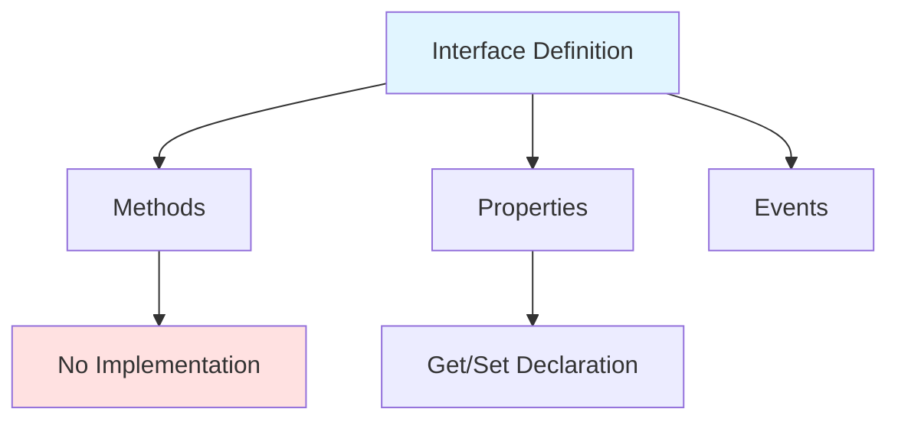
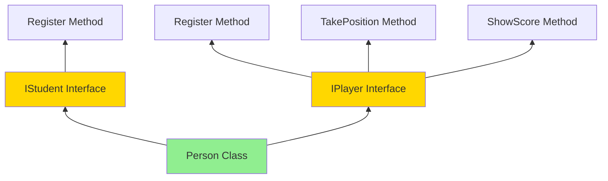
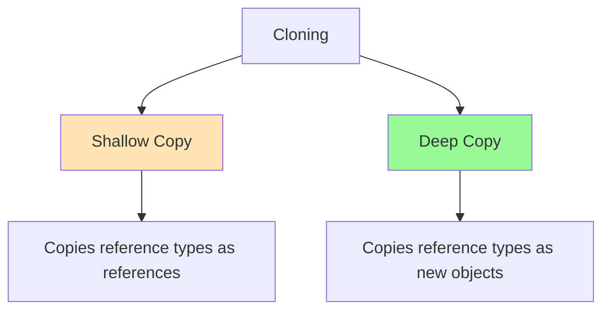
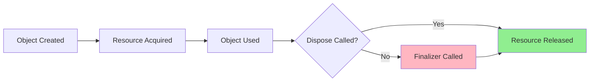
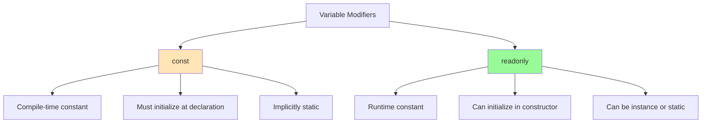
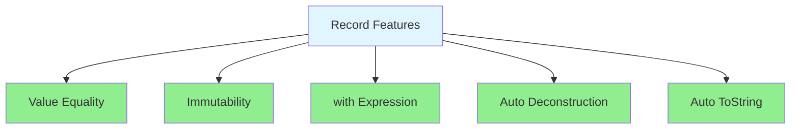

# C# Day 9 - Advanced OOP Concepts

## Table of Contents

1. [Interfaces](#interfaces)
2. [Built-in .NET Interfaces](#built-in-net-interfaces)
3. [Resource Management](#resource-management)
4. [Modern C# Features](#modern-c-features)

---

## 1. Interfaces

### What is an Interface?

An **interface** is a contract that defines a set of methods, properties, or events that a class must implement. It defines **what** a class should do, but not **how** it does it.

### Key Characteristics

- Cannot contain implementation (prior to C# 8.0)
- Cannot have fields (only properties)
- All members are implicitly `public`
- A class can implement multiple interfaces
- Used for achieving abstraction and multiple inheritance

### Syntax Diagram



### Basic Example

```csharp
interface IStudent
{
    void Register();
    int Age { get; set; }
}

interface IPlayer
{
    void TakePosition(int position);
    void Register();
    int ShowScore();
}
```

### Multiple Interface Implementation

```csharp
class Person : IStudent, IPlayer
{
    public int Age { get; set; }
    public int Score { get; set; }
    
    // Explicit interface implementation for IStudent
    void IStudent.Register()
    {
        Console.WriteLine("Register as student");
    }
    
    // Explicit interface implementation for IPlayer
    void IPlayer.Register()
    {
        Console.WriteLine("Register as player");
    }
    
    // Public implementation
    public void Register()
    {
        Console.WriteLine("General registration");
    }
    
    public void TakePosition(int position)
    {
        Console.WriteLine($"Position: {position}");
    }
    
    public int ShowScore()
    {
        return Score;
    }
}

// Usage
Person p = new Person();
p.Register(); // Calls public version

IStudent student = p;
student.Register(); // Calls IStudent version

IPlayer player = p;
player.Register(); // Calls IPlayer version
```

### Interface Inheritance Hierarchy



---

## 2. Built-in .NET Interfaces

### 2.1 IComparable<T> Interface

**Purpose**: Allows objects to be sorted and compared.

**Method to Implement**:

```csharp
int CompareTo(T other)
```

**Return Values**:

- `< 0` : Current object is less than other
- `= 0` : Objects are equal
- `> 0` : Current object is greater than other

**Example Implementation**:

```csharp
class Student : IComparable<Student>
{
    public int Id { get; set; }
    public string Name { get; set; }
    public int Age { get; set; }
    
    public Student(int id, string name, int age)
    {
        Id = id;
        Name = name;
        Age = age;
    }
    
    // Compare by age
    public int CompareTo(Student? other)
    {
        if (other == null) return 1;
        return Age.CompareTo(other.Age);
    }
    
    public override string ToString()
    {
        return $"{Id}-{Name}-{Age} years old";
    }
}

// Usage
Student[] students = new Student[]
{
    new Student(1, "Ali", 12),
    new Student(2, "Mohamed", 20),
    new Student(3, "Mostafa", 18),
    new Student(4, "Sayed", 22),
    new Student(5, "Said", 17)
};

Array.Sort(students); // Sorts by age

foreach (var student in students)
{
    Console.WriteLine(student);
}

// Output (sorted by age):
// 1-Ali-12 years old
// 5-Said-17 years old
// 3-Mostafa-18 years old
// 2-Mohamed-20 years old
// 4-Sayed-22 years old
```

### 2.2 ICloneable Interface

**Purpose**: Creates a copy of an object.

**Method to Implement**:

```csharp
object Clone()
```

**Types of Cloning**:



**Example Implementation**:

```csharp
class Student : ICloneable
{
    public int Id { get; set; }
    public string Name { get; set; }
    public int Age { get; set; }
    
    public Student(int id, string name, int age)
    {
        Id = id;
        Name = name;
        Age = age;
    }
    
    // Shallow clone
    public object Clone()
    {
        return new Student(Id, Name, Age);
    }
    
    // Alternative: Deep clone with MemberwiseClone
    public Student DeepClone()
    {
        return (Student)this.MemberwiseClone();
    }
}

// Usage
Student original = new Student(3, "Mostafa", 22);
Student clone = (Student)original.Clone();

clone.Name = "Ahmed"; // Doesn't affect original

Console.WriteLine(original.Name); // Mostafa
Console.WriteLine(clone.Name);    // Ahmed
```

### 2.3 IDisposable Interface

**Purpose**: Releases unmanaged resources (files, database connections, network streams).

**Method to Implement**:

```csharp
void Dispose()
```

**Resource Management Pattern**:



**Example Implementation**:

```csharp
class Student : IDisposable
{
    public int Id { get; set; }
    public string Name { get; set; }
    public int Age { get; set; }
    
    private FileStream fileStream;
    private bool disposed = false;
    
    public Student(int id, string name, int age)
    {
        Id = id;
        Name = name;
        Age = age;
        fileStream = new FileStream("student.txt", FileMode.OpenOrCreate);
    }
    
    // Dispose method
    public void Dispose()
    {
        Dispose(true);
        GC.SuppressFinalize(this); // Prevent finalizer from running
    }
    
    // Protected dispose method
    protected virtual void Dispose(bool disposing)
    {
        if (!disposed)
        {
            if (disposing)
            {
                // Dispose managed resources
                fileStream?.Dispose();
                Console.WriteLine("Dispose method called");
            }
            
            // Dispose unmanaged resources here (if any)
            
            disposed = true;
        }
    }
    
    // Finalizer (destructor)
    ~Student()
    {
        Dispose(false);
        Console.WriteLine("Finalizer called");
    }
}

// Usage with 'using' statement
using (Student s = new Student(1, "Ali", 20))
{
    Console.WriteLine(s.Name);
} // Dispose automatically called here

// Alternative: using declaration (C# 8.0+)
using Student s2 = new Student(2, "Mohamed", 22);
Console.WriteLine(s2.Name);
// Dispose called at end of scope
```

---

## 3. Resource Management

### 3.1 Scope Operator

Variables declared inside braces `{}` are scoped to that block.

```csharp
{
    Student s = new Student(1, "Ali", 20);
    Console.WriteLine(s.Name);
} // s goes out of scope here and becomes eligible for garbage collection

// s is not accessible here
```

### 3.2 Using Statement

Ensures `Dispose()` is called automatically when object goes out of scope.

**Syntax**:

```csharp
using (ResourceType resource = new ResourceType())
{
    // Use resource
} // Dispose() automatically called
```

**Modern Syntax (C# 8.0+)**:

```csharp
using ResourceType resource = new ResourceType();
// Use resource
// Dispose() called at end of method/scope
```

### 3.3 Finalizers (Destructors)

Called by garbage collector before object is destroyed.

**Syntax**:

```csharp
~ClassName()
{
    // Cleanup code
}
```

**⚠️ Important Notes**:

- Non-deterministic (you don't know when it runs)
- Should not be relied upon for critical cleanup
- Use `IDisposable` instead for deterministic cleanup

### Comparison: Dispose vs Finalizer

|Feature|Dispose()|Finalizer (~)|
|---|---|---|
|**Timing**|Deterministic (you control when)|Non-deterministic (GC decides)|
|**Performance**|Fast|Slower (2 GC cycles)|
|**Usage**|Implement IDisposable|Backup cleanup|
|**Best Practice**|✅ Use for cleanup|⚠️ Rarely needed|

---

## 4. Modern C# Features

### 4.1 Implicit Type Local Variables (`var`)

**Purpose**: Compiler infers the type from the initialization expression.

```csharp
// Explicit type
int x = 5;
string name = "Ali";
List<int> numbers = new List<int>();

// Implicit type (var)
var x = 5;              // int
var name = "Ali";       // string
var numbers = new List<int>(); // List<int>

// ❌ Cannot use var without initialization
// var y; // Error!

// ❌ Cannot use var with null
// var z = null; // Error!

// ✅ Can use with nullable types
var y = (int?)null;
```

**When to Use `var`**:

- ✅ Type is obvious from right side: `var student = new Student()`
- ✅ With anonymous types: `var person = new { Name = "Ali", Age = 20 }`
- ✅ With LINQ queries: `var results = students.Where(s => s.Age > 18)`
- ❌ When type is not obvious: `var result = GetData()` (prefer explicit type)

### 4.2 Readonly vs Const



**Example**:

```csharp
class Employee
{
    // const - compile-time constant
    public const int MaxAge = 65;
    public const string Company = "TechCorp";
    
    // readonly - runtime constant
    public readonly int Id;
    public readonly DateTime HireDate;
    
    public Employee(int id)
    {
        Id = id; // ✅ Can assign in constructor
        HireDate = DateTime.Now;
    }
    
    public void UpdateId(int newId)
    {
        // Id = newId; // ❌ Error! Cannot reassign readonly
    }
}

// Usage
Console.WriteLine(Employee.MaxAge); // 65
Employee emp = new Employee(101);
Console.WriteLine(emp.Id); // 101
```

|Feature|const|readonly|
|---|---|---|
|**Assignment**|Declaration only|Declaration or constructor|
|**Value**|Compile-time|Runtime|
|**Scope**|Implicitly static|Instance or static|
|**Types**|Primitive types, strings|Any type|
|**Modification**|Never|Never (after initialization)|

### 4.3 Primary Constructors (C# 12)

**Purpose**: Simplified constructor syntax for classes and records.

**Traditional Approach**:

```csharp
class Employee
{
    public int Id { get; set; }
    public string Name { get; set; }
    public int Age { get; set; }
    
    public Employee(int id, string name, int age)
    {
        Id = id;
        Name = name;
        Age = age;
    }
}
```

**Primary Constructor Approach**:

```csharp
class Employee(int id, string name, int age)
{
    public int Id { get; set; } = id;
    public string Name { get; set; } = name;
    public int Age { get; set; } = age;
    
    // Constructor chaining
    public Employee(int id, string name) : this(id, name, 18)
    {
    }
    
    public override string ToString()
    {
        return $"{Id}-{Name}-{Age}";
    }
}

// Usage
Employee emp1 = new Employee(1, "Ali", 25);
Employee emp2 = new Employee(2, "Mohamed"); // Age defaults to 18
Console.WriteLine(emp1); // 1-Ali-25
Console.WriteLine(emp2); // 2-Mohamed-18
```

### 4.4 Deconstructors

**Purpose**: Break down an object into individual variables.

**Implementation**:

```csharp
class Subject
{
    public int Id { get; set; }
    public string Name { get; set; }
    public int Duration { get; set; }
    
    public Subject(int id, string name, int duration)
    {
        Id = id;
        Name = name;
        Duration = duration;
    }
    
    // Deconstructor method
    public void Deconstruct(out int id, out string name, out int duration)
    {
        id = Id;
        name = Name;
        duration = Duration;
    }
    
    public override string ToString()
    {
        return $"{Id}-{Name}-{Duration} Hours";
    }
}

// Usage
Subject subject = new Subject(1, "C#", 60);

// Method 1: Explicit out variables
subject.Deconstruct(out int id, out string name, out int duration);
Console.WriteLine(name); // C#

// Method 2: Tuple syntax (preferred)
var (id2, name2, duration2) = subject;
Console.WriteLine($"{id2}, {name2}, {duration2}"); // 1, C#, 60

// Method 3: Discard unwanted values
var (_, subjectName, _) = subject;
Console.WriteLine(subjectName); // C#
```

### 4.5 Records (C# 9.0+)

**Purpose**: Immutable reference types designed for data storage.

**Syntax**:

```csharp
record Point(int X, int Y, int Z);
```

**Full Example**:

```csharp
// Simple record
record Point(int X, int Y, int Z);

// Usage
Point p1 = new Point(1, 2, 3);
Point p2 = new Point(1, 2, 3);
Point p3 = p1; // Reference to same object

// Value-based equality
Console.WriteLine(p1 == p2); // True (compares values, not references)
Console.WriteLine(p1 == p3); // True

// Immutability - cannot modify
// p1.X = 5; // ❌ Error! Properties are init-only

// 'with' expression - non-destructive mutation
Point p4 = p1 with { Y = 6 };
Console.WriteLine(p1); // Point { X = 1, Y = 2, Z = 3 }
Console.WriteLine(p4); // Point { X = 1, Y = 6, Z = 3 }

// Deconstruction (automatic)
var (x, y, z) = p1;
Console.WriteLine($"X: {x}, Y: {y}, Z: {z}"); // X: 1, Y: 2, Z: 3

// ToString() automatically implemented
Console.WriteLine(p1); // Point { X = 1, Y = 2, Z = 3 }
```

**Record Features**:



**Record vs Class**:

|Feature|Record|Class|
|---|---|---|
|**Equality**|Value-based|Reference-based|
|**Mutability**|Immutable by default|Mutable|
|**ToString()**|Auto-generated|Must override|
|**Deconstruction**|Auto-generated|Must implement|
|**with expression**|✅ Supported|❌ Not supported|
|**Inheritance**|✅ Supported|✅ Supported|
|**Use Case**|DTOs, Value objects|Complex behaviors|

**Advanced Record Example**:

```csharp
// Record with additional members
record Person(string FirstName, string LastName, int Age)
{
    // Additional properties
    public string FullName => $"{FirstName} {LastName}";
    
    // Methods
    public bool IsAdult() => Age >= 18;
    
    // Can have mutable properties
    public string Email { get; set; }
}

// Usage
Person person = new Person("Ali", "Ahmed", 25)
{
    Email = "ali@example.com"
};

Console.WriteLine(person.FullName);  // Ali Ahmed
Console.WriteLine(person.IsAdult()); // True

// Create modified copy
Person older = person with { Age = 30 };
Console.WriteLine(older.Age); // 30
Console.WriteLine(person.Age); // 25 (original unchanged)

// Record inheritance
record Student(string FirstName, string LastName, int Age, string StudentId) 
    : Person(FirstName, LastName, Age);

Student student = new Student("Mohamed", "Ali", 20, "STU001");
Console.WriteLine(student); // Student { FirstName = Mohamed, LastName = Ali, Age = 20, StudentId = STU001 }
```

---

## Summary Cheat Sheet

### Interfaces

- Contract for classes to implement
- Multiple inheritance support
- Use explicit implementation for member name conflicts

### Built-in Interfaces

|Interface|Purpose|Method|
|---|---|---|
|`IComparable<T>`|Sorting|`int CompareTo(T other)`|
|`ICloneable`|Object copying|`object Clone()`|
|`IDisposable`|Resource cleanup|`void Dispose()`|

### Resource Management

```csharp
using (var resource = new Resource())
{
    // Use resource
} // Auto-disposed

// Or modern syntax
using var resource = new Resource();
```

### Modern C# Features

- `var` - Type inference
- `const` - Compile-time constant
- `readonly` - Runtime constant
- Primary constructors - Simplified syntax
- Deconstructors - Break objects apart
- Records - Immutable data classes

---

## Practice Exercises

### Exercise 1: Interfaces

Create a `IShape` interface with `double GetArea()` and `double GetPerimeter()`. Implement it in `Circle` and `Rectangle` classes.

### Exercise 2: IComparable

Create a `Product` class with `Name` and `Price`. Implement `IComparable<Product>` to sort by price.

### Exercise 3: IDisposable

Create a `Logger` class that writes to a file. Implement `IDisposable` to ensure the file is closed properly.

### Exercise 4: Records

Create a `Book` record with Title, Author, and Year. Test equality, `with` expressions, and deconstruction.

---

## Additional Resources

- [Microsoft Docs - Interfaces](https://learn.microsoft.com/en-us/dotnet/csharp/fundamentals/types/interfaces)
- [Microsoft Docs - IDisposable](https://learn.microsoft.com/en-us/dotnet/api/system.idisposable)
- [Microsoft Docs - Records](https://learn.microsoft.com/en-us/dotnet/csharp/language-reference/builtin-types/record)
- [Garbage Collection in .NET](https://learn.microsoft.com/en-us/dotnet/standard/garbage-collection/)

---

_Last Updated: Day 9 Lecture - Advanced C# OOP Concepts_